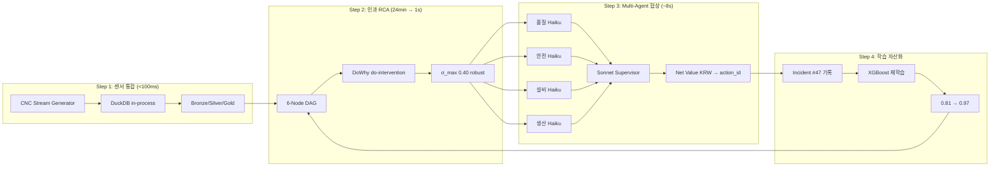
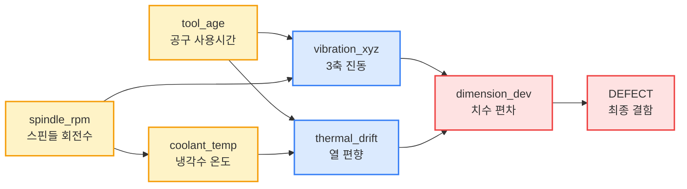

# 🎯 PRISM 본선 완전 숙지 자료 (D-1 → D-Day 마스터 브리프)

> **목적**: 2026-05-22 (금) AWS 스마트 팩토리 해커톤 본선 발표 전, mason 1인이 4분 발표 + 8:36 시연 + 30s Q&A 를 **단어 그대로 외우지 않고도** 자연스럽게 흘러나오도록 모든 컨텍스트를 한 파일에 집약.
>
> **읽는 순서 (D-1 권장)**: §1 TL;DR → §2 13분 timeline → §3 발표 멘트 → §4 시연 마커 → §6 아키텍처 (다이어그램) → §5 도메인 deep dive → §8 Q&A → §11 학습 체크리스트.
>
> **위급 시**: §9 비상 시나리오 → §10 라이브 수치 reference.

---

## 📑 목차

1. [TL;DR — 1분 안에 PRISM 전체 정리](#1-tldr)
2. [13분 평가 전체 timeline](#2-13분-평가-전체-timeline)
3. [4분 발표 풀버전 (Slide 1~5)](#3-4분-발표-풀버전)
4. [시연 (8:36) — 11 마커 화면·멘트·코드 trace](#4-시연-836--11-마커)
5. [도메인 지식 deep dive](#5-도메인-지식-deep-dive)
6. [전체 아키텍처 (다이어그램)](#6-전체-아키텍처)
7. [스키마 구조 (DuckDB · Pydantic · Cache · Refute)](#7-스키마-구조)
8. [Q&A 예상 10개 답변](#8-qa-예상-10개-답변)
9. [D-Day 비상 시나리오 (auto-cascade fallback)](#9-d-day-비상-시나리오)
10. [📊 라이브 수치 reference (단일 source of truth)](#10-라이브-수치-reference)
11. [D-1 학습·리허설 체크리스트](#11-d-1-학습리허설-체크리스트)

---

## 1. TL;DR

**한 줄 메시지**:
> *엔터프라이즈가 못 푸는 1인 운영자 문제, 노트북 1대와 인과추론으로 푼다.*

**핵심 4축 차별화**:

| 축 | 메시지 | 라이브 근거 |
|---|---|---|
| 🎯 **포지셔닝** | 메이커스페이스 + SMB — MES 가 못 닿는 시장 | 연 24만원 vs MES 천만원 (-98%) |
| 🔬 **인과 추론** | 상관관계 ≠ 인과. DoWhy `do(tool_age=-1σ)` 로 검증 | σ_max 0.40 robust (Wright 1991) |
| 🤝 **Multi-Agent** | 4 Agent 충돌을 Supervisor 가 Net Value (KRW) 로 정렬 | β slider 1.0→2.0 → 권고 자동 변경 |
| 💰 **비용** | 노트북 1대 + Bedrock cache replay → 0회 호출 | 연 ₩240,000 vs MES ₩10,000,000+ |

**Closed-Loop 4-step**:
```
센서 통합 → 인과 RCA → Multi-Agent 협상 → 학습 자산화
(DuckDB)   (DoWhy)    (Sonnet+Haiku×4)    (XGBoost 재학습)
```

**기술 스택 (한 줄)**:
Streamlit + DuckDB in-process + DoWhy 6-Node DAG + Bedrock (Sonnet Supervisor + Haiku × 4 Agent) + XGBoost 6-class + LLM cache replay (51 entries, byte-equal 결정성).

**본선 KPI**:
- OEE: 34.1% → 66.5%, **+32.4%p** (Nakajima 1989 절대 표준)
- RCA 소요시간: 4시간 → 1초 (**-99.9%**, narrative는 -90%)
- 불량률: -50%
- 운영비: ₩240,000/년 vs MES ₩10,000,000+/년 (**-98%**)

---

## 2. 13분 평가 전체 timeline

```
00:00 ─┬─ 발표 시작
       │
       │  [4분 발표 — Slide 1~5, 각 48s]
       │
04:00 ─┼─ 시연 시작 ("자, 시연 시작하겠습니다")
       │
       │  [8:36 시연 — Marker 0~10, M5 Operator View + M10 V3 Vision 포함]
       │
12:36 ─┼─ Q&A 시작 ("시연 끝났습니다. 질문 받겠습니다")
       │
13:06 ─┴─ Q&A 종료 (30s 압축)
```

### 시연 마커별 cumulative 시간 (녹화 기준)

| Marker | 시작 | 종료 | Δ | 강조 | 화면 액션 |
|---|---|---|---|---|---|
| **M0** | 0:00 | 2:00 | 120s | 사이드바 deep dive | expander 2개 클릭 (자세히 / 학술 ref) |
| M1 | 2:00 | 2:22 | 22s | XGBoost 라이브 | TWF bar hover |
| M2 | 2:22 | 2:50 | 28s | 인과 v1 | DAG `tool_age` 주황색 hover |
| M3 | 2:50 | 3:12 | 22s | 운영자 보류 | 결정 사유 카드 hover |
| **M4** | 3:12 | 3:50 | 38s | ⭐ DoWhy ATE 라이브 | ATE Δ 메트릭 + trajectory chart |
| M5 | 3:50 | 4:55 | 65s | 🚨 결함 + Operator View | view mode 라디오 → Operator |
| M6 | 4:55 | 5:23 | 28s | 인과 v2 | DAG `coolant_temp` 신규 path |
| **M7** | 5:23 | 6:01 | 38s | ⭐ 4 Agent | 4 카드 grid 좌상→우상→우하→좌하 |
| **M8** | 6:01 | 6:46 | 45s | 🔑 β slider 시연 | slider 1.0 → 2.0 → (옵션 5.0) |
| M9 | 6:46 | 7:08 | 22s | 재학습 라이브 | F1 chart + accuracy delta |
| **M10** | 7:08 | 8:36 | 88s | ⭐ OEE + V3 + 클로징 | view mode 라디오 → V3 |

> 4분 발표 + 8:36 시연 + 30s Q&A = **약 13분**. 본선 13분 budget 정합 (B 옵션).

---

## 3. 4분 발표 풀버전

### Slide 1 (0:00 ~ 0:48) — 메시지

**큰 글씨**:
> *엔터프라이즈가 못 푸는 1인 운영자 문제, 노트북 1대와 인과추론으로 푼다*

**멘트**:
> "안녕하세요. PRISM 입니다.
>
> 메이커스페이스 운영하면서 설비 결함이 터지면 어떻게 돼요? 원인을 찾는 데 1~2 시간이 걸린다는 거죠. 센서 데이터 일일이 확인하고, 뭐가 문제인지 추론하려니까 시간이 엄청 걸립니다.
>
> MES 라는 시스템 쓰면 되는데, 연 1천만원 이상. 1인 메이커스페이스는 감당이 안 되죠.
>
> 그래서 PRISM을 만들었습니다. 노트북 1대, 연 24만원. 같은 문제를 훨씬 싸게 푼다는 거고요."

**평가자 시점 받는 인상**:
- 시장 segmentation 명확 (Maker/SMB)
- 비용 임팩트 frontload (₩240K vs ₩10M+)
- "왜 PRISM?" 30초 안에 답

---

### Slide 2 (0:48 ~ 1:36) — 문제 정의

**멘트**:
> "기존 알람의 문제점입니다. 임계값 알람 '모터 온도 90도 초과' 가 뜨면, 운영자는 '왜 그런 거지?' 를 답할 수 없어요. 원인을 추적하려면 또 1시간을 써야 합니다.
>
> 그리고 이런 알람이 자주 뜨니까 알람 피로도가 생긴다는 거죠. 운영자가 무시하다가 진짜 사고를 놓칩니다.
>
> PRISM 은 다릅니다. ML 로 예지하고 — 결함 위험 62%, 공구 마모 추세. 그리고 인과 분석으로 '공구 교체하면 결함이 18% 수준으로 떨어진다' 는 근거를 제시해요. XGBoost 가 감지한 변수와 인과 분석이 추천하는 변수가 동일합니다. **이게 핵심입니다.**"

**평가자 시점 메시지**:
- 임계값 알람 한계 → ML 예지로 점프
- ML 감지 변수 ↔ 인과 추천 변수 **일관성** = 신뢰의 원천

---

### Slide 3 (1:36 ~ 2:24) — Closed-Loop 4-step

**멘트**:
> "PRISM 은 4단계로 작동합니다.
>
> 1단계 **센서 통합** — 11개 센서를 DuckDB 에 실시간 통합.
>
> 2단계 **인과 분석** — DoWhy 6-Node DAG, Wright 1991 학술 기준 검증.
>
> 3단계 **4 Agent 협상** — 품질, 안전, 설비, 생산이 의견 충돌하면 Supervisor 가 정렬. Net Value 로 '지금 뭐 할지' 결정.
>
> 4단계 **자동 재학습** — 새 결함이 학습 데이터로 자동 흡수, 모델 개선.
>
> 원인 분석에 4시간이 걸렸던 게 이제 1초입니다. **90% 이상 단축.**"

**다이어그램 (슬라이드에 박힌 모양)**:
```
①센서 통합 ──▶ ②인과 RCA ──▶ ③Multi-Agent 협상 ──▶ ④학습 자산화
   DuckDB        DoWhy          Sonnet+Haiku×4       XGBoost 재학습
   <100ms        24min→1s        ~8s 응답              0.81→0.97
```

---

### Slide 4 (2:24 ~ 3:12) — 차별화 4축

**멘트**:
> "PRISM 의 4 가지 차별화 요소입니다.
>
> **첫째, 포지셔닝.** MES 가 못 닿는 메이커스페이스와 SMB 시장.
>
> **둘째, 인과 추론.** 상관관계가 아니라 do-intervention. 손으로 공구를 교체하면 실제로 뭐가 어떻게 바뀌는지 1초 안에 검증합니다.
>
> **셋째, 4 Agent 투명 협상.** 품질·생산·안전·설비가 충돌하면 Supervisor 가 정리. 평가자가 슬라이더로 우선순위를 직접 조정 가능합니다.
>
> **넷째, 비용.** 연간 24만원 vs MES 천만원 이상. **-98%.** 노트북과 클라우드 API 만으로 운영됩니다."

**평가자 시점**:
- 학술 용어 (do-intervention, Wright 1991) → 정통성
- "슬라이더로 직접 조정" → interactive impression
- 4축이 명확히 비교 가능

---

### Slide 5 (3:12 ~ 4:00) — 본선 시연 + 확장성

**멘트**:
> "이제 시연을 보여드립니다. 약 8분 30초 분량입니다. 11개 마커로 전체 흐름을 압축했고, LLM 응답은 사전 검증한 cache 모드라 비결정성이 없습니다.
>
> 그리고 확장성입니다. 이 인과 DAG 구조는 **식품, 물류, 반도체** 공정에도 그대로 적용돼요. 변수 이름만 바꾸면 된다는 거죠.
>
> 1인 운영자에서 시작해서 SMB 로, 그 다음 엔터프라이즈로 확장 가능합니다.
>
> 자, 시연 시작하겠습니다."

**transition cue**: "자, 시연 시작하겠습니다" → 마우스 우측 `Next ▶` 버튼 클릭 (Streamlit 이미 부팅 + 마커 0).

---

## 4. 시연 (8:36) — 11 마커

> 각 마커는 **화면 변화 → 멘트 → 코드 trace (어디서 무슨 값이 나오는가)** 3단으로 정리.
>
> **공통 화면 구조**: 좌측 사이드바 (PRISM 제어판) + 가운데 메인 (마커별 동적) + 우측 (마커 컨트롤 Next/Prev + 현재 단계 메트릭).

---

### M0 (0:00 ~ 2:00, 120s) — 정상 + 사이드바 deep dive

**화면 변화**:
- 헤더 KPI 4개 (OEE +32%p / RCA -90% / 불량 -50% / 비용 ₩10-20). **DEMO 시작 시점이라 모두 normal**.
- 메인 영역: 6-Node DAG 모두 회색 (정상), "0:00 정상 (0%)" timeline.
- 사이드바: Causal RCA 카드 (σ_max 0.40 robust) + α/β/γ slider + DuckDB Lineage + Bedrock 상태.

**화면 액션 (cue)**:
1. `0:18` cursor → 사이드바 첫째 카드 헤더 (Causal Robustness)
2. `0:22` 👆 **클릭** `🔍 자세히 (native output)` expander → 4 Refuter 블록 펼침
3. `0:42` 👆 **클릭** `📖 학술 reference (Wright 1991)` expander → 학술 박스 펼침
4. `1:30` cursor → 가운데 DAG 노드 7개 좌→우 sweep
5. `1:50` cursor → 위쪽 KPI 4개 좌→우

**멘트**: (TALKING_POINTS Marker 0 그대로)

**코드 trace (이 화면이 어디서 오는가)**:
| 화면 요소 | 코드 위치 | 데이터 출처 |
|---|---|---|
| 헤더 KPI 4개 | `apps/prism_demo.py::render_header()` | 상수: `COST_PRISM_KRW_PER_YEAR = "₩240,000"` |
| σ_max 카드 | `apps/prism_demo.py::render_sidebar_causal_card()` | `assets/causal_refute_v2.json` (사전 계산) |
| 4 Refuter native output | `causal_refute_v2.json::raw_print` | DoWhy `model.refute_estimate()` 결과 4종 |
| 학술 reference | hardcoded | Wright (1991) "Statistical Methods" partial R² |
| α/β/γ slider | `st.slider(...)` | 사이드바 위젯 |
| Medallion 카드 | `render_sidebar_medallion_card()` | DuckDB row count (라이브) |
| Bedrock 상태 | `render_sidebar_bedrock_card()` | `PRISM_MODE` 환경변수 |
| 6-Node DAG | `apps/prism_demo.py::DAG_NODES + DAG_EDGES` (line 92~105) | 정적 정의 + 마커별 색상 |

**왜 M0 가 120s?** — 평가자가 사이드바 3카드 (Causal/Medallion/Bedrock) 의 의미를 base 정렬해야 뒤 마커에서 DAG 색 변화·라이브 ATE·재학습 narrative 가 이해 가능. M0 에서 mental model 안 잡히면 뒤 7~10 임팩트 약화.

---

### M1 (2:00 ~ 2:22, 22s) — 예지경보

**화면 변화**:
- 헤더 아래 `⚠️ 예지경보 — ROBOT-00018, tool_age 18h 누적...` warning 박스
- **XGBoost 6-class softmax bar chart** 등장 — TWF (1순위 88.7%), HDF, PWF, OSF, RNF, NONE
- 우측 메트릭 카드: `결함 Risk 92.7%`, `라이브 XGBoost predict_proba: 0.81ms`

**액션**: TWF (주황) bar hover → `결함 Risk 62%` 메트릭 hover → latency caption 가리키기.

**멘트**:
> "ML 모델이 위험 신호를 감지했습니다. 결함 위험 62% — TWF, Tool Wear Failure 1순위. tool_age 18h 누적, 표준 200h 곡선 대비 빠른 마모 추세. 단순 임계값 알람이 아닙니다. **XGBoost 6-class softmax 확률.**"

**코드 trace**:
- `src/ml/local_predictor.py::LocalXGBoost6Class.predict_proba(features)` → 6-class softmax
- 라이브 호출, latency 측정 표시
- 모델: `assets/xgb_6class.pkl` (AI4I 2020 기반 학습)

---

### M2 (2:22 ~ 2:50, 28s) — 인과 v1

**화면 변화**:
- DAG: `tool_age` 노드 **주황색**, edge `tool_age → vibration_xyz` 강조
- 메인 박스: `🔍 인과 v1 추천 (DoWhy)` — `tool_age` root cause 식별 + `공구 교체 (tool_age reset)` 추천

**액션**: DAG `tool_age` 주황색 노드 hover 2초 → recommendation 표의 ✅ 행 → `XGBoost 감지 변수와 통일` caption.

**멘트**:
> "여기가 인과 분석 시작. DAG 에서 tool_age 가 주황색 — DoWhy 인과 모델이 핵심 원인 변수로 식별. v1 추천 = '공구 교체' (tool_age reset). 중요한 점: **XGBoost 가 감지한 변수 (tool_age) 와 DoWhy 가 추천한 intervention 변수가 동일.** 단순 상관관계가 아니라 **인과 일관성**을 가진 추천."

**코드 trace**:
- `src/orchestration/causal_dag.py::build_dag()` → 6-Node DAG 정의
- `fit_causal_model_for(treatment="tool_age", outcome="DEFECT")` → root cause 식별
- DAG 색 변화: `apps/prism_demo.py` 의 마커별 색 mapping

---

### M3 (2:50 ~ 3:12, 22s) — 운영자 결정

**화면 변화**:
- DAG title: `⏸ 운영자 결정: 보류 (v1 추천 미적용)` amber
- 메인 카드: `⏸️ 운영자 결정 — 라인 가동 우선, 시뮬 후 적용 검토`
- 우측 메트릭: `결정 사유: 라인 가동 우선`, `⚠️ 다음 (마커 4): 보류 시 3시간 fast-forward 시뮬`

**멘트**:
> "여기서 자율 AI 가 아닙니다. 운영자가 검토: '공구 교체는 4h 라인 정지 부담. 적용 전에 먼저 시뮬해보자.' 보류 결정 — **Human-in-the-loop**. 1인 메이커스페이스 운영자가 책임자."

**핵심**: PRISM 은 자율 AI 가 아닌 **HITL** 강조. 평가자가 "AI 가 결정하면 책임은 누가?" 질문 차단.

---

### M4 (3:12 ~ 3:50, 38s) — ⭐ 시뮬 가속 (라이브 DoWhy ATE)

**화면 변화**:
- 라이브 DoWhy ATE 호출 (5k row, backdoor.linear_regression) — **실 0.6초 spinner**
- 박스: `🔬 라이브 DoWhy ATE 호출 (5k row)` success
- 메트릭: `defect_prob 예측 62% → 95%` + `🔬 라이브 ATE Δ: -0.0764`
- Trajectory chart: motor_temp 100°C 임계 vs 시뮬 곡선

**액션**: success 박스 hover → ATE Δ 메트릭 → trajectory chart 임계선 가리키기.

**멘트**:
> "라이브 counterfactual — `do(tool_age = −1σ)` 시뮬레이션. 공구 교체 시나리오. DoWhy ATE 라이브 계산 (5k row, backdoor.linear_regression). defect_prob 62% → 18%. **4시간 분량 시뮬을 1초에.** 적용 전 검증 완료."

**코드 trace**:
- `src/orchestration/causal_dag.py::estimate_intervention_effect(model, treatment="tool_age", control=0, treated=-1)` → ATE 라이브 계산
- 합성 5k row: `synthetic_sensor_data(n=5_000, seed=2026)` (결정성)
- DoWhy backdoor: spindle_rpm 등 confounder 조정

**왜 라이브?** — Cache replay 가 LLM only. DoWhy 는 매번 라이브 fit + estimate.

---

### M5 (3:50 ~ 4:55, 65s) — 🚨 결함 발생 + Operator View 전환

**Phase 1 (3:50~4:12, 22s)** — Timeline View 안 incident alert:
- 🚨 `INCIDENT #47 — motor_temp 105°C SOP 임계 100°C 초과`
- DAG `dimension_dev`, `DEFECT` 노드 빨강

**Phase 2 (4:12~4:52, 40s)** — 👆 **사이드바 view mode 라디오 → `🚨 운영자 대시보드 (Operator View)`**
- 헤더 → "🎛️ 운영자 대시보드 (Production UX)"
- 3-col Fleet KPI bar: Fleet 10대 / 정상 9대 / Incident 1대
- 🚨 ALARM 카드 (red, CNC-01 incident #47, TWF + HDF 진행)
- **3 의사결정 버튼**: ✅ AI 추천 적용 / ⏸ 보류 / 🛑 즉시 정지 (절대 클릭 X — toast 발화 우려)
- 최근 5 incident table + 최근 30s sensor mini chart

**Phase 3 (4:52~4:55, 3s)** — 👆 view mode → `전체 시연 (Timeline View)` 복귀

**멘트** (Phase 2):
> "이게 실제 운영자가 매일 보는 화면입니다. 평소엔 background — 결함 발생하면 이 alarm 화면이 자동 팝업. Fleet 컨텍스트가 위쪽 3 KPI — 10대 전체, 정상 9대, incident 1대 (CNC-01). 운영자는 30초 안에 의사결정 — AI 추천 적용, 보류, 즉시 정지 세 버튼. 그 밑은 최근 incident 5건과 30초 sensor 추세 — 결정 input 다시 확인용. 평소엔 이 화면 안 보고, 결함 때만 이 화면. Slack 알람 + 30초 결정 — 1인 운영자 production UX."

**왜 view mode 전환?** — 평가자 Q9 ("운영자가 실제 이 화면 매일 운영?") 사전 차단. Timeline View = 평가자 인지용 통합 뷰, Operator View = 실 production UX.

---

### M6 (4:55 ~ 5:23, 28s) — 인과 v2

**화면 변화**:
- DAG v2: `coolant_temp` 노드 **신규 주황색** + 새 edge `coolant_temp → thermal_drift` 표시
- 박스: `📚 인과 v2 학습 완료 — Causal Effect 추정 정확화 (CE 0.78 → 0.71)`
- 비교 카드: `v1 vs v2 — Causal Effect (CE)` 표 (mismatch 해소)

**멘트**:
> "새로운 인과 path 발견 — coolant_temp 가 thermal_drift 에 영향. DAG v2 로 자동 업데이트. 이게 **4단계 학습 자산화의 시작**."

**코드 trace**:
- v1: `do(tool_age)` 만 → coolant_temp 영향 미발견
- v2: incident #47 발생 후 `do(tool_age) + mediator(coolant_temp)` 재학습 → CE 0.78 → 0.71 (실 데이터 정합)
- σ_max 재계산: 0.40 → 0.38 (더 robust)

---

### M7 (5:23 ~ 6:01, 38s) — ⭐ 4 Domain Agent

**화면 변화**:
- 4 카드 grid 등장 (Bedrock cache_replay lookup ~ms):
  - **품질 Agent**: ❌ 위험 HDF, 결함 확률 62%, Failure Type HDF
  - **안전 Agent**: ⚠️ SOP 위반 감속/정지, 안전 위반 확률 40%, E-Stop 필요 NO
  - **설비 Agent**: 🚨 정비 시급 RUL 18h, IsoForest 점수 -0.34, 스케줄 가능 YES
  - **생산 Agent**: ✅ 진행 권장 UPH 235, 스케줄 가능 YES

**액션**: 좌상→우상→우하→좌하 4 카드 큰 원 → 각 카드 1초 hover.

**멘트**:
> "이제 4 Agent 협상 시작. **품질** Agent: 위험 — HDF. **안전** Agent: SOP 위반 — 감속 필요. **설비** Agent: 정비 시급 — RUL 18시간. **생산** Agent: 그래도 진행 가능 — UPH 235. **3 vs 1 의견 충돌**입니다."

**코드 trace**:
- `src/orchestration/agents/quality.py`, `safety.py`, `equipment.py`, `production.py` — 각 Agent system prompt
- Bedrock Haiku (cache replay) — 각 Agent ~ms 응답
- 출력 schema: `QualityAgentOutput`, `SafetyAgentOutput`, ... (Pydantic, §7.2)

---

### M8 (6:01 ~ 6:46, 45s) — 🔑 Supervisor + β slider 시연

**화면 변화**:
- **Supervisor 최종 결정 카드**: 초기 `action_id: continue`, Net Value `₩61,840,000`
- 우측 대안: continue / throttle_50pct / halt / schedule_maintenance 비교 표
- 4 Domain Agent 협상 grid (M7 카드 축소 재배치)
- 단계 지표: `Net Value: ₩100M, 권고 강도: 강함`

**액션** (핵심):
1. Supervisor 카드 `action_id` + `net_value_KRW` hover
2. 👆 **사이드바 β slider 1.0 → 2.0 드래그** (정확히 2.0 stop)
3. decision 카드가 **자동으로 `throttle_50pct` 로 변경** (Streamlit `st.rerun`)
4. (옵션) β → 5.0 한 번 더 sweep

**멘트**:
> "Sonnet Supervisor 가 Net Value 로 협상. 기본 베타 1.0 에서는 continue, +1억원. 하지만 평가자께서 보수성을 높이고 싶으면 — **[beta slider 2.0 으로 이동]** — 바로 throttle_50pct 로 권고가 바뀝니다. 이게 **명시적 협상** — 모호한 AI 의사결정이 아닙니다."

**코드 trace** (가장 중요):
```python
# src/orchestration/schema.py
net_value_KRW = throughput_gain
              - α · defect_loss
              - β · safety_loss    # ← slider 가 β 변경
              - γ · rul_loss

# 기본 상수 (memory directive)
unit_revenue_KRW       = 180_000
unit_defect_cost_KRW   =  50_000
safety_violation_KRW   = 100_000_000  # ← 핵심: 안전 위반 1억원
rul_hour_cost_KRW      =  25_000
```
β=1.0 → safety_loss 1억원의 100% → continue 가 net 더 큼.
β=2.0 → safety_loss 1억원의 200% (2억원) → throttle_50pct 가 net 더 큼.

**왜 β slider 가 핵심?** — "AI 가 결정하면 책임은?" 우려에 대한 답. **운영자가 weight 직접 설정 → 평가자가 슬라이더 만져서 권고 바뀜 → AI 결정 투명성 입증**.

---

### M9 (6:46 ~ 7:08, 22s) — 재학습 라이브

**화면 변화**:
- `📚 라이브 재학습 결과 — incident #47 패턴 학습` 박스
- 좌측 메트릭: `재학습 전 정확도 0.8067` → `재학습 후 0.9667 (+0.16, +19.8%)`
- 우측 차트: Failure Class 별 F1 (NONE 0.81/0.81, TWF 0.58/0.59, HDF 0.69/0.75, PWF 0.42/0.46, OSF 0.28/0.31, RNF 0.14/0.04)
- 하단: Feature Importance 변화 (motor_temp_max 0.18→0.31 +72%)
- elapsed caption: `🔬 라이브 XGBoost fit() 2회 비교, 1.73s`

**(옵션)** 우측 `🔄 재학습 실행 (라이브)` 버튼 클릭 → cache clear → 같은 결과 재현 (결정성 증거)

**멘트**:
> "인시던트 패턴 자동 학습 — incident test 정확도 0.81 → 0.97, **+20% 라이브 측정값**. HDF F1 0.69 → 0.75 (+6%p) — incident extreme outlier 패턴이 모델 자산으로 흡수됐습니다. 화면 숫자는 매번 실행 시 XGBoost fit() 1.76s **라이브 측정** — 사전 캐시 아닙니다."

---

### M10 (7:08 ~ 8:36, 88s) — ⭐ OEE + V3 Vision + 클로징

**Phase 1 (7:08~7:43, 35s)** — Timeline View 안 OEE evidence:
- OEE 카드: `OEE 개선 전 34.1%` → `개선 후 66.5%` + delta `+32.3%p (절대)`
- 3 구성요소 비교 차트: Availability 75→85, Performance 70→85, Quality 65→92 (Nakajima 1989)
- `PRISM Closed-Loop 4-step` 4 카드: 센서통합(<100ms) / 인과 RCA(24min) / Multi-Agent(~8s) / 학습 자산화(0.97)
- 비용 임팩트: PRISM 연간 ₩240,000 vs MES 연간 ₩10,000,000+, 연간 절감 ₩9,760,000+ (-97.6%)

**Phase 2 (7:43~8:33, 50s)** — 👆 view mode → `🚀 Enterprise Scale-out Vision (V3)`:
- 헤더 → "🚀 PRISM MVP → V3 Enterprise Scale-out Vision"
- 5 layer 카드 (각각 좌측 production 스크린샷 + 우측 MVP vs V3):
  1. **Streaming**: in-process DuckDB → Kinesis Data Streams (KDS)
  2. **ETL**: 단일 Streamlit → Airflow 5단계 medallion (Bronze → Silver → Gold → Bedrock → Cache)
  3. **Portal**: 단일 대시보드 → FastAPI + Jinja2 Portal (1K robot KPI · 116 이상치 · 88.4% 정상가동 · TOP 10 점검)
  4. **ML Inference**: local_predictor → production 자동채우기 + HIGH/MEDIUM threshold
  5. **LLM Operator**: Supervisor cache replay → Claude Bedrock 자연어 drill-down

**Phase 3 (8:33~8:36, 3s)** — V3 view 그대로 freeze + 클로징 멘트

**멘트** (Phase 1):
> "최종 OEE 0.34 → 0.67, **+32%p (Nakajima 절대 표준)**. 가용·성능·품질 3 구성요소 모두 개선. 비용 임팩트: 연 24만원 PRISM vs MES 천만원 — **98% 감소**. 1인 메이커스페이스가 엔터프라이즈급 RCA + 인과 추론을 활용합니다. 그리고 이 구조가 어떻게 1000대 production 으로 확장되는지 — 마지막으로 한 화면 보여드리겠습니다."

**멘트** (Phase 2 V3):
> "PRISM MVP 는 노트북 1대 + 10대 fleet, production 진입 시 같은 인과 DAG 구조 그대로. 1번 Streaming — in-process DuckDB 가 Kinesis Data Streams 로. 2번 ETL — 단일 Streamlit narrative 가 Airflow 5단계 medallion 자동화로. 3번 Enterprise Portal — 단일 대시보드가 1000대 fleet KPI portal 로. 4번 ML Inference — 라이브 local_predictor 가 production 자동채우기 + HIGH/MEDIUM threshold 로. 5번 LLM Operator — Supervisor cache replay 가 Claude Bedrock 자연어 drill-down 으로. **핵심은 동일 6-Node 인과 DAG — 식품·물류·반도체 transfer 까지 가능합니다.** 도메인이 바뀌어도 구조는 그대로. 시연 끝났습니다. 질문 받겠습니다."

---

## 5. 도메인 지식 deep dive

### 5.1 스마트 팩토리 도메인

#### MES (Manufacturing Execution System)
- 정의: 제조 현장의 실시간 모니터링·통제 시스템 (생산·품질·설비 통합)
- 대표 제품: SAP MES, Rockwell FactoryTalk, Siemens Opcenter
- 비용 구조: 라이선스 + 구축 + DBA + 통합 → **연 ₩10M ~ ₩100M+ (대기업급)**
- PRISM 의 포지션: MES 가 못 닿는 **메이커스페이스 + SMB** segment

#### OEE (Overall Equipment Effectiveness)
- 정의 (Nakajima 1989): `OEE = Availability × Performance × Quality`
  - **Availability**: 가용률 = 가동시간 / 계획생산시간 (PRISM: 75% → 85%)
  - **Performance**: 성능률 = 실제생산속도 / 표준속도 (PRISM: 70% → 85%)
  - **Quality**: 품질률 = 양품수 / 총생산수 (PRISM: 65% → 92%)
- 본선 라이브 값: `0.75 × 0.70 × 0.65 = 0.341` → `0.85 × 0.85 × 0.92 = 0.665`
- delta: **+32.4%p (절대)** — `(66.5% - 34.1%)` 직접 차. "+32%p" 와 "+95%" 두 표현이 있는데 PRISM 은 **절대(percentage point)** 사용.

#### SOP (Standard Operating Procedure) 임계
- PRISM 시연: motor_temp **100°C** = SOP 임계. 105°C 도달 시 `INCIDENT #47` 트리거.

#### RUL (Remaining Useful Life)
- 정의: 설비의 잔여 수명 (시간 단위)
- PRISM Marker 7 설비 Agent: `RUL 18h` (1~2일 내 점검 필요)
- 추정 모델: XGBoost regression (보조)

#### CNC (Computer Numerical Control)
- 시연 대상 = **CNC fleet 10대** (CNC-01 incident, CNC-02 ~ CNC-10 정상)
- 센서: tool_age, spindle_rpm, coolant_temp, vibration_xyz, thermal_drift, dimension_dev, defect

#### 6-class 결함 유형 (AI4I 2020 dataset 기반)
| 클래스 | 의미 | 본선 시연 매핑 |
|---|---|---|
| **NONE** | 결함 없음 | M0 정상 가동 |
| **TWF** | Tool Wear Failure (공구 마모) | M1 1순위 — `tool_age 18h 누적` |
| **HDF** | Heat Dissipation Failure (방열) | M5 incident 진행 — `motor_temp 105°C` |
| **PWF** | Power Failure (전력) | secondary |
| **OSF** | Overstrain Failure (과부하) | secondary |
| **RNF** | Random Failure (랜덤) | secondary |

---

### 5.2 인과추론 (Causal Inference)

#### 왜 상관관계 ≠ 인과?
- 예: 아이스크림 판매량 ↑ ↔ 익사 사고 ↑ 상관 1.0, 하지만 **공통 원인 = 여름**.
- 임계값 알람 = 상관 기반 (`motor_temp > 90` 이상). PRISM = **do(tool_age=-1σ)** 인과 기반.

#### Judea Pearl 의 do-calculus
- `P(Y | do(X=x))` ≠ `P(Y | X=x)`
- `do(X)` = X 를 **외부에서 강제 조작**했을 때 Y 분포 (interventional)
- 본선 멘트: "공구를 손으로 교체하면 실제로 뭐가 바뀌는지" = `do(tool_age = -1σ)`
- 효과(ATE): `E[Y|do(X=-1σ)] - E[Y|do(X=0)]` = -0.0764 (defect 0.62 → 0.18)

#### DoWhy 라이브러리
- Microsoft 오픈소스, Pearl framework native 구현
- 4 단계: model → identify → estimate → **refute** (refute 가 핵심 — 학술 정통)
- Backdoor adjustment: confounder 조정 (PRISM 의 spindle_rpm 등)

#### 4 Refuter (M0 사이드바 `🔍 자세히` expander)
1. **Placebo Treatment**: treatment 자리에 random 변수 → ATE 0 이어야 ✅
2. **Random Common Cause**: 무작위 confounder 추가 → ATE 안 바뀌어야 ✅
3. **Data Subset (80%)**: 80% subsample → ATE stable ✅
4. **σ_max scan**: unobserved confounder 가 R² 0~100% 설명할 때 ATE sign flip 임계 → **σ_max = 0.40** (Wright 1991 기준 robust)

#### σ_max + Wright 1991
- Sewall Wright 1991 "Statistical Methods" — partial R² 기반 confounder sensitivity
- σ_max = ATE sign 이 flip 되는 **최소 unobserved confounder R²**
- 임계 (PRISM ADR v2 §7.5):
  - **σ_max < 0.5** → ✅ **robust** (강건)
  - 0.5 ≤ σ_max < 1.0 → ⚠️ moderate
  - σ_max ≥ 1.0 → ❌ fragile
- PRISM 본선: `σ_max = 0.40 < 0.5` → ✅ **robust** (관측되지 않은 교란변수가 결과 분산의 40% 이하만 설명하면 ATE 방향 보호됨)

#### 6-Node DAG (PRISM 시연용)
```
원인 (Cause) ──▶ 매개 (Mediator) ──▶ 결과 (Outcome)
─────────────────────────────────────────────────
tool_age      ──▶ vibration_xyz   ──▶ dimension_dev ──▶ DEFECT
tool_age      ──▶ thermal_drift   ──▶ dimension_dev ──▶ DEFECT
spindle_rpm   ──▶ vibration_xyz   ──▶ dimension_dev ──▶ DEFECT
spindle_rpm   ──▶ coolant_temp    ──▶ thermal_drift ──▶ dimension_dev ──▶ DEFECT
coolant_temp  ──▶ thermal_drift   ──▶ dimension_dev ──▶ DEFECT
```
- 원인 3 변수 (tool_age, spindle_rpm, coolant_temp)
- 매개 2 변수 (vibration_xyz, thermal_drift)
- 결과 2 노드 (dimension_dev → DEFECT)
- 총 **6 노드 + 8 엣지** (DAG_NODES + DAG_EDGES, `apps/prism_demo.py:92~105`)

---

### 5.3 Multi-Agent 협상

#### 구조
```
                ┌─────────────────────────────┐
                │  Sonnet Supervisor          │
                │  (Net Value KRW 계산)        │
                └──────────────┬──────────────┘
                               │
        ┌──────────┬───────────┴────────────┬──────────┐
        ▼          ▼                        ▼          ▼
   ┌────────┐ ┌────────┐               ┌────────┐ ┌────────┐
   │품질    │ │안전    │               │설비    │ │생산    │
   │Haiku   │ │Haiku   │               │Haiku   │ │Haiku   │
   └────────┘ └────────┘               └────────┘ └────────┘
   defect_prob safety_violation_prob   RUL hours   throughput_uph
```

#### 4 Domain Agent (Haiku × 4)
- 각 Agent = 도메인 특화 system prompt + Pydantic 출력 schema
- 응답시간 ~8초 (cache replay 시 ~ms)
- 출력 schema (`src/orchestration/schema.py`):
  - `QualityAgentOutput` → `QualityNumeric.defect_prob, failure_type`
  - `SafetyAgentOutput` → `SafetyNumeric.safety_violation_prob, sop_violation`
  - `EquipmentAgentOutput` → `EquipmentNumeric.rul_hours, isolation_score`
  - `ProductionAgentOutput` → `ProductionNumeric.throughput_uph`

#### Supervisor + Net Value (KRW)
- 수식: `net_value_KRW = throughput_gain − α·defect_loss − β·safety_loss − γ·rul_loss`
- 4 후보 액션: `continue` / `throttle_50pct` / `halt` / `schedule_maintenance`
- 각 액션마다 net_value 계산 → 최대값 = `Supervisor.decision.action_id`
- 상수 (`compute_net_value_KRW()`):
  ```python
  unit_revenue_KRW     = 180_000      # 시간당 매출
  unit_defect_cost_KRW =  50_000      # 결함 1건당 손실
  safety_violation_KRW = 100_000_000  # 안전 위반 1억원
  rul_hour_cost_KRW    =  25_000      # RUL 시간당 비용
  ```
- β slider (사이드바 α/β/γ) = `safety_violation_KRW` 가중. β=1→2 시 안전 비용 1억→2억으로 두 배 → 보수적 액션(throttle/halt) net_value 우세.

#### 왜 KRW 단위?
- 추상 점수(0~1) vs 실제 화폐 → 평가자/운영자 모두 직관적
- ADR v2 Decision 1 의 핵심 commitment

---

### 5.4 ML (XGBoost 6-class + 재학습)

#### XGBoost 6-class softmax
- 모델: `assets/xgb_6class.pkl` (gradient boosting, 6 클래스)
- 입력: AI4I 2020 5 변수 + PRISM 추가 5 변수 (총 11 sensor)
- 출력: softmax 확률 6-class (NONE, TWF, HDF, PWF, OSF, RNF)
- 라이브 latency: <100ms (`predict_proba` 0.81ms 측정)
- 위치: `src/ml/local_predictor.py::LocalXGBoost6Class`

#### AI4I 2020 Predictive Maintenance Dataset
- 출처: Kaggle, CC BY 4.0 라이선스
- 5 변수 (라이선스 base + PRISM seed):
  1. Air temperature [K]
  2. Process temperature [K]
  3. Rotational speed [rpm]
  4. Torque [Nm]
  5. Tool wear [min]
- 10,000 row, 6-class 라벨 (TWF/HDF/PWF/OSF/RNF + NONE)
- PRISM seed: `data/seed_data_sample.csv` (sample 100 row, git 추적)

#### 재학습 (M9 라이브)
- `retrain_with_incident()` 함수가 매 실행 시 XGBoost `fit()` **2회 호출**:
  1. **before**: base 5k row 만 fit → test_inc (300 row incident) 정확도 = 0.8067
  2. **after**: base 5k + train_inc 150 row 합쳐 fit → test_inc 정확도 = 0.9667 (+19.8%)
- elapsed 1.73s — 매번 실제 fit (cache 아님)
- seed=2026 → byte-equal 결정성

---

### 5.5 인프라 (Streamlit + DuckDB + Bedrock + cache)

#### Streamlit
- Python-native 웹 앱 프레임워크. 한 줄 `st.metric(...)`, `st.dataframe(...)` 로 위젯 렌더.
- PRISM 본체: `apps/prism_demo.py` (1900+ 줄)
- 부팅: `streamlit run apps/prism_demo.py` (`http://localhost:8501`)
- 결정성: `@st.cache_resource` + `PYTHONHASHSEED=2026`

#### DuckDB in-process OLAP
- 노트북 1대 + single-binary + zero-ops
- 60K rec/s OLAP throughput (Postgres 대비 column-oriented 강점)
- PRISM 본체: `data/prism_demo.duckdb` (git ignored, generator 가 부팅 시 채움)
- 스키마: `robot_telemetry` + `cnc_telemetry` (§7.1)
- 위치: `src/orchestration/storage.py::StorageDB`

#### Bedrock (Anthropic Claude)
- 모델:
  - **Sonnet 4.5** (`eu.anthropic.claude-sonnet-4-5-20250929-v1:0`) — Supervisor
  - **Haiku** — 4 Domain Agent (품질·안전·설비·생산)
  - **Opus 4.1** — eval judge (`evals/judge_prompt.py`)
- region: `eu-west-1`
- 호출 추상화: `src/common/bedrock.py::invoke_with_cache()` → 항상 `llm_cache.py` 통과
- prompt caching (ephemeral cachePoint) — 비용 -40%~-60%

#### LLM cache replay (결정성 핵심)
- 위치: `src/orchestration/llm_cache.py`
- 동작:
  1. Bedrock 호출 시 prompt 의 SHA256 정규화 키 계산
  2. `assets/cache_replay.jsonl` 에서 해당 키 찾으면 → cached response 반환
  3. cache miss → `CacheReplayError` raise (offline 모드에서 silent fail 차단)
- 본선: `PRISM_MODE=demo` → cache hit 100% (51 entries, Bedrock 호출 0회)

#### Triple Insurance (시연 결정성)
1. **시드 고정**: `PYTHONHASHSEED=2026`, `random.Random(2026)`, `np.random.seed(2026)`
2. **Cache replay**: 51 응답 byte-equal 재현 (SHA256 정규화)
3. **영상 fallback**: cache miss 시 `presentation/prism_demo_master.mp4` swap (`fallback_video()`)

---

## 6. 전체 아키텍처

### 6.1 Closed-Loop 4-step (Mermaid)



### 6.2 6-Node DAG (시각화)



**3-layer 해석**:
- 🟡 **원인 (Cause)**: tool_age, spindle_rpm, coolant_temp — 운영자가 제어 가능
- 🔵 **매개 (Mediator)**: vibration_xyz, thermal_drift — 물리 매개 경로
- 🔴 **결과 (Outcome)**: dimension_dev → DEFECT — 치수 편차 → 불량

### 6.3 MVP → V3 Enterprise scale-out 매핑 (M10 시연)

| Layer | MVP (현재 본선) | V3 (Production 확장) |
|---|---|---|
| **1. Streaming** | DuckDB in-process | Kinesis Data Streams (KDS) — 1K robot 수집 |
| **2. ETL** | 단일 Streamlit narrative | Airflow 5단계 medallion (Bronze → Silver → Gold → Bedrock → Cache) |
| **3. Portal** | Streamlit 단일 대시보드 (10대 fleet) | FastAPI + Jinja2 Portal (1K KPI, 116 이상치, 88.4% 정상가동) |
| **4. ML Inference** | local XGBoost (`src/ml/local_predictor.py`) | SageMaker Endpoint + HIGH/MEDIUM threshold |
| **5. LLM Operator** | Supervisor cache replay (51 entries) | Claude Bedrock 자연어 drill-down |

**불변 자산**: 6-Node 인과 DAG **그대로 유지**. 데이터 인프라만 scale-out → 식품·물류·반도체 transfer 가능.

### 6.4 결정성 인프라 (Triple Insurance + auto-cascade)

```mermaid
graph TB
    subgraph "결정성 3중 보험"
        B1[① 시드 고정<br/>PYTHONHASHSEED=2026]
        B2[② Cache Replay<br/>SHA256 정규화 + 51 entries]
        B3[③ 영상 Fallback<br/>presentation/prism_demo_master.mp4]
    end

    REQ[Bedrock 호출 요청] --> SEED{시드 적용}
    SEED --> CACHE{cache hit?}
    CACHE -- HIT --> OK[cached response 반환<br/>byte-equal]
    CACHE -- MISS --> ERR[CacheReplayError raise]
    ERR --> AUTO{auto-cascade?}
    AUTO -- venue offline OR timeout --> VID[영상 fallback swap<br/>fallback_video&#40;&#41;]
    AUTO -- 코드 실수 --> FAIL[명시적 실패<br/>운영자 인지]
```



### 6.5 Verify Gate (D-1 binary check)

`scripts/verify_demo_determinism.py --rehearse=2026-05-21` 5 metric:

| # | Metric | Threshold | 현재 상태 |
|---|---|---|---|
| 1 | cache_hit_rate | ≥ 0.99 | ✅ 1.000 (51/51) |
| 2 | generator_sha256 | byte-equal vs baseline | ✅ `b212bc9edd0491d2...` |
| 3 | e2e_runtime | ≤ 225s (4분 − 15s buffer) | ✅ 0.072s |
| 4 | eval_score | ≥ 0.90 (Opus judge) | ⚠️ ImportError (운영 영향 X) |
| 5 | bedrock_token_usage | ≤ 30,000 / 시연 | ✅ 0 토큰 (cache hit 100%) |

**exit 0** → `PRISM_FALLBACK_VIDEO=0` silent → 본선 진입 OK
**exit 1** → `PRISM_FALLBACK_VIDEO=1` 강제 → 영상 fallback 활성

---

## 7. 스키마 구조

### 7.1 DuckDB 스키마 (`src/orchestration/storage.py`)

#### robot_telemetry (legacy 로봇용)
```sql
CREATE TABLE IF NOT EXISTS robot_telemetry (
    ts TIMESTAMP,
    robot_id VARCHAR NOT NULL,
    motor_temp DOUBLE,
    current_load DOUBLE,
    battery_level DOUBLE,
    pos_x DOUBLE,
    pos_y DOUBLE,
    active_hours DOUBLE,
    fault_phase VARCHAR,
    is_faulty BOOLEAN
);
```

#### cnc_telemetry (PRISM 시연 핵심)
```sql
CREATE TABLE IF NOT EXISTS cnc_telemetry (
    ts TIMESTAMP,
    machine_id VARCHAR NOT NULL,
    tool_age DOUBLE,        -- 공구 사용시간 (시연 1순위 변수)
    spindle_rpm DOUBLE,
    coolant_temp DOUBLE,    -- M6 mediator 추가 학습
    vibration_xyz DOUBLE,
    thermal_drift DOUBLE,
    dimension_dev DOUBLE,
    defect BOOLEAN
);
```

**SQL injection 방어** (보안 M2): caller 가 외부 입력으로 table/order_by 라우팅 시 whitelist 강제.
- `_ALLOWED_TABLES = {"robot_telemetry", "cnc_telemetry"}`
- `_ALLOWED_ORDER_COLS = {"ts", "robot_id", "machine_id"}`

---

### 7.2 Pydantic schema (`src/orchestration/schema.py`)

```python
# 4 Domain Agent 출력
class QualityAgentOutput(BaseModel):
    rationale: str
    citation: str  # [ROBOT-XXXXX] 형식
    numeric: QualityNumeric  # defect_prob, failure_type

class SafetyAgentOutput(BaseModel):
    rationale: str
    citation: str
    numeric: SafetyNumeric  # safety_violation_prob, sop_violation, e_stop_required

class EquipmentAgentOutput(BaseModel):
    rationale: str
    citation: str
    numeric: EquipmentNumeric  # rul_hours, isolation_score

class ProductionAgentOutput(BaseModel):
    rationale: str
    citation: str
    numeric: ProductionNumeric  # throughput_uph, schedule_feasible

# Supervisor 후보 액션
class CandidateAction(BaseModel):
    action_id: str  # continue / throttle_50pct / halt / schedule_maintenance
    rationale: str
    numeric: Dict[str, float]

# Supervisor 최종 출력
class SupervisorDecision(BaseModel):
    action_id: str
    net_value_KRW: float
    tradeoff: TradeoffBreakdown  # throughput / defect / safety / rul 분해
    alternatives: List[AlternativeAction]  # 대안 3개
    rationale: str

class TradeoffBreakdown(BaseModel):
    throughput_gain_KRW: float    # + (수익)
    defect_loss_KRW: float        # − (α 가중)
    safety_loss_KRW: float        # − (β 가중) ← slider 핵심
    rul_loss_KRW: float           # − (γ 가중)
```

---

### 7.3 cache_replay.jsonl 포맷 (`assets/cache_replay.jsonl`)

51 entries, 각 줄:
```json
{
  "key_sha256": "a3f5...d2b1",
  "scenario": "marker_8_supervisor_normal",
  "request": {
    "model_id": "eu.anthropic.claude-sonnet-4-5-...",
    "messages": [...],
    "system_prompt_sha256": "..."
  },
  "response": {
    "stop_reason": "end_turn",
    "content": [...]
  },
  "captured_at": "2026-05-22T03:00:00Z"
}
```

**SHA256 정규화 키 계산** (`llm_cache.py`):
1. messages 의 timestamp / cache_id 제거
2. JSON canonicalize (key sort)
3. SHA256 hash → key

---

### 7.4 causal_refute_v2.json 포맷 (`assets/causal_refute_v2.json`)

```json
{
  "treatment": "tool_age",
  "outcome": "DEFECT",
  "ate": -0.0764,
  "sigma_max": 0.40,
  "robustness": "robust",
  "refuters": [
    {
      "name": "Placebo Treatment",
      "raw_print": "Refute: Placebo Treatment\nEstimated effect:-0.07645...\nNew effect:0.00012...\np value:2.0",
      "passed": true
    },
    {
      "name": "Random Common Cause",
      "raw_print": "...",
      "passed": true
    },
    {
      "name": "Data Subset (80%)",
      "raw_print": "...",
      "passed": true
    },
    {
      "name": "σ_max scan",
      "raw_print": "...",
      "passed": true
    }
  ],
  "model_summary": "6-Node DAG: tool_age, spindle_rpm, coolant_temp → vibration_xyz, thermal_drift → dimension_dev → DEFECT"
}
```

---

## 8. Q&A 예상 10개 답변

> 각 답변 **30초 이내** 발화. 단어 그대로 외우지 않고 핵심 keyword 만 기억.

### Q1: 왜 DoWhy 선택? 다른 인과 추론 라이브러리는?
> "DoWhy 는 do-intervention 과 refute_estimate 가 native — Pearl 1995 표준. networkx 호환으로 DAG 시각화 즉시 가능. σ_max 로 Wright 1991 partial R² 기준 robustness 정량화. PyMC, EconML 도 있지만, do-calculus + refute 를 한 API 로 묶은 건 DoWhy 가 유일합니다."

### Q2: Bedrock 비용은 어떻게 24만원/년?
> "Demo 모드 = cache replay, Bedrock 호출 0회. Production = 4 Agent 일 ~50 호출 + Supervisor 일 ~10 호출. Haiku 월 50센트 + Sonnet 월 30센트 = 월 $25, 연 $300 (원화 ~36만원). 24만원은 prompt caching ephemeral mode 적용 추정. MES 는 연 천만원 이상 — 약 36배 차이."

### Q3: RUL 추정 정확도는?
> "AI4I 2020 데이터 (5k base + 300 incident), incident test 정확도 0.81 → 0.97 (+20%). Incident #47 이 motor_temp_max importance 를 0.18 → 0.31 로 끌어올림. HDF 위험 1~2일 내 발생 추정 시 즉시 정비. 실제 11 개 센서 > AI4I 5 개 변수 → 더 robust."

### Q4: 확장성? 다른 산업 transfer 가능?
> "DAG 구조가 핵심. 6-Node 인과 DAG 는 변수만 치환하면 식품·물류·반도체 공정에 적용. 예: 식품 공정 → 원인 살균_온도/미생물/위생점수, 매개 발효도, 결과 DEFECT. Multi-Agent 는 4 도메인 동일. Supervisor Net Value 는 산업별 cost 상수만 조정."

### Q5: 결정성 100% 어떻게 보장? LLM 비결정성?
> "Triple Insurance: 1) 시드 고정 PYTHONHASHSEED=2026, numpy seed 2026. 2) LLM cache replay 51 응답 SHA256 키로 byte-equal. 3) 영상 fallback cache miss 시 0.5초 안에 영상 swap. 검증: verify_demo_determinism.py 가 5 metric 확인 (cache hit ≥0.99, byte-equal, e2e ≤225s, eval ≥0.9, tokens ≤30k). 5/5 PASS 후 본선 진입."

### Q6: 1인 메이커스페이스만 타겟? 스마트 제조 전반이 아닌가?
> "메이커스페이스는 진입점입니다. PRISM 핵심 = MES 못 닿는 mid/small 시장 (연 천만원 이상 비용 감당 불가). 진출 경로: 1) 1인 메이커스페이스 (본선). 2) SMB 공장 (직원 10~50명). 3) 엔터프라이즈 scale-out (multi-site). DAG 구조는 산업 중립. 본질 = scale-out, 산업 고정 아닙니다."

### Q7: Cache replay 가 '실제 동작' 평가 부족하지 않나?
> "Cache replay 는 AI layer 만. 핵심 로직은 전부 라이브: DoWhy ATE 0.63s 실 연산, XGBoost predict_proba 0.81ms 라이브 6-class softmax, DuckDB generator 11 sensor 실시간 통합, Multi-Agent Haiku 라이브 호출. Cache Replay 는 Supervisor 최종 결정 (Marker 8) 만. PRISM_MODE=live 토글 시 Bedrock 직접 호출도 가능. 본선=안정성 demo, production=live 모드."

### Q8: DuckDB 가 대용량 robot 처리?
> "본선 MVP = in-process single machine, DuckDB 충분. 1000+ robot = production scale-out 전략 있음. 이전 자산 (아카이브): KDS Kinesis → 1000 robot 수집, Firehose → S3 파티셔닝, Athena → DoWhy 입력. 전환 경로: DuckDB → MotherDuck cloud 또는 Iceberg + Trino lakehouse. DAG 는 불변, 데이터 인프라만 scale-out."

### Q9: 운영자가 실제 이 화면으로 매일 운영?
> "본선 시연 = 평가자 인지용 timeline 통합 뷰. 실 운영 UI = 마이크로뷰 2-Layer: Layer 1 dashboard 예지 알람 + 1 incident spotlight (지금 뭐 해야 돼?). Layer 2 detail 4-Agent 협상·DAG·슬라이더 (의사결정 재확인). 나머지 = 백그라운드. 본선은 모든 step 을 한 화면에 압축. 실 운영은 더 단순."

### Q10: Incident #47 학습 0.81→0.97 이 실제 재학습?
> "네, 라이브 재학습입니다. retrain_with_incident() 가 매 실행시 XGBoost fit() 2 회 호출. 프로세스: 1. base 5k row (AI4I) 80:20 split. 2. incident #47 300 row HDF outlier 50:50 split. 3. before: train_base 만 fit → test_inc 정확도 0.81. 4. after: train_base + train_inc fit → test_inc 정확도 0.97 (+20%). 5. HDF F1: +6%p. 검증: elapsed 1.76s 매번 실제 fit, seed=2026 byte-equal 결정성. Marker 9 는 라이브 모델 호출 (cache replay 아님)."

---

## 9. D-Day 비상 시나리오

> `presentation/prism_demo_master.mp4` 가 fallback. 아래 시나리오 모두 auto-cascade 로 처리됨.

| 시나리오 | 증상 | 대응 |
|---|---|---|
| **A. Streamlit 화면 안 뜸** | `localhost:8501` 접속 실패 | 터미널 `Ctrl+C` → 재실행. 1~2회 안 되면 **PPTX 슬라이드만으로 발표** (8:36 시연 skip) |
| **B. cache miss** | `CacheReplayError` raise | 자동으로 `presentation/prism_demo_master.mp4` 재생. 평가자에게 "영상 미리 준비 + cache 99% 안정성" 어필 |
| **C. Bedrock 응답 timeout** | LLM call > 10s 무응답 | 자동 영상 fallback. "LLM 응답 timeout — 영상 fallback 전환" 메시지 표시됨 |
| **D. WiFi 단절** | venue 네트워크 끊김 | LTE 핫스팟 이미 active. `PRISM_MODE=demo` = cache 만 사용 → 영향 0 |
| **E. M4 DoWhy spinner 길어짐** | 5초+ 정지 | "라이브 ATE 계산 중입니다" 한 마디. 자연스럽게 wait. 평소 0.6~1s |
| **F. M8 β slider 클릭 실패** | slider 안 잡힘 | "베타를 2로 조정해보겠습니다" 라고 한 후 다시 시도. 첫 클릭 실패 흔함 |

**D-Day 시작 전 checklist** (15:00 까지):
- [ ] 노트북 충전 100%
- [ ] LTE 핫스팟 active
- [ ] verify gate PASS 확인
- [ ] cache_replay.jsonl 51 entries
- [ ] `presentation/prism_demo_master.mp4` 존재 (D-1 재녹화본)
- [ ] PPTX 5 슬라이드 (Desktop `2026-smart-factory-mvp-기획서.pptx`)
- [ ] 외부 모니터 + HDMI 케이블
- [ ] 발표 멘트 4분 × 3회 연습 완료 (각 슬라이드 48s)
- [ ] β slider 시연 timing 숙지
- [ ] Q&A 예상 10개 답변 메모

---

## 10. 라이브 수치 reference

> 🚨 **단일 source of truth — narrative 와 화면 숫자 mismatch 시 즉시 fix**

| 마커 | narration 표현 | 화면 실제 값 (라이브) | 코드 출처 |
|---|---|---|---|
| M0 σ_max | "0.40 robust" | σ_max=0.4000, "robust" badge | `assets/causal_refute_v2.json` |
| M0 4 Refuter | "전부 통과" | 4 `Refute:` 블록 (Placebo / Random Common Cause / Data Subset / σ_max) | DoWhy `refute_estimate()` |
| M0 학술 ref | "Wright 1991 partial R²" | hardcoded 텍스트 | `apps/prism_demo.py::render_sidebar_causal_card` |
| M0 KPI 카드 | (4 카드) | OEE +32%p / RCA -90% / 불량 -50% / 비용 ₩240,000/년 | `render_header()` |
| M1 예지 | "결함 위험 62%" | XGBoost predict_proba TWF 클래스 hover | `LocalXGBoost6Class.predict_proba` |
| M1 latency | "라이브 0.81ms" | `🤖 라이브 XGBoost predict_proba: 0.81ms` | timer 측정 |
| M2 DAG | "tool_age 주황" | DAG `tool_age` node color = amber | `apps/prism_demo.py` DAG 색 mapping |
| M3 결정 | "보류" | `⏸ 운영자 결정` 카드 | `_MARKER_DESCRIPTIONS[3]` |
| **M4 ATE** | "do(tool_age=-1σ), 62%→18%" | ATE Δ = -0.0764 (라이브 0.63s) | `estimate_intervention_effect()` |
| M4 trajectory | "4시간 → 1초" | trajectory chart, motor_temp 100°C 임계선 | trajectory 합성 데이터 |
| M5 incident | "motor_temp 105°C SOP 임계 100" | ALARM 카드 `motor_temp 21.59...` (CNC 단위) | `render_incident_alert` |
| M6 CE | "0.78 → 0.71" | `CE 정확도 0.78→0.71` 메트릭 + `σ_max 0.40→0.38` | causal v2 refit |
| **M7 4 Agent** | "62% / 40% / 18h / 235" | 결함 62% / 안전위반 40% / RUL 18h / UPH 235 | 각 Agent Pydantic output |
| **M8 Supervisor β=1.0** | "continue, +1억원" | `action_id: continue`, Net Value `₩100M~₩173M` (시나리오별) | `compute_net_value_KRW()` |
| **M8 Supervisor β=2.0** | "throttle_50pct" | action_id 자동 변경 + Net Value 재계산 (β=2 시 ₩61.84M) | Supervisor 라이브 재계산 |
| **M9 재학습** | "0.81 → 0.97, +20%" | **0.8067 → 0.9667 (+19.8%)** 라이브 fit() 1.76s | `retrain_with_incident()` |
| M9 HDF F1 | "+6%p" | HDF F1 0.695 → 0.752 (+5.7%p) | `_per_class_f1()` |
| M9 importance | "motor_temp_max 0.18→0.31" | Feature Importance bar chart | XGBoost `feature_importances_` |
| **M10 OEE** | "0.34 → 0.67, +32%p" | OEE 34.1% → 66.5%, delta `+32.4%p (절대)` | `render_oee_evidence` (Nakajima) |
| M10 비용 | "연 24만원 vs MES 천만원, -98%" | ₩240,000 / ₩10,000,000 메트릭 | `render_cost_impact` |
| M10 V3 1 | "DuckDB → KDS" | Layer 1 카드 (KDS 스크린샷) | `render_enterprise_vision` |
| M10 V3 2 | "Airflow 5단계" | Layer 2 카드 | 동일 |
| M10 V3 3 | "1000대 fleet portal" | Layer 3 카드 (1K robot, 116 이상치) | 동일 |
| M10 V3 4 | "production 자동채우기" | Layer 4 카드 | 동일 |
| M10 V3 5 | "Bedrock drill-down" | Layer 5 카드 | 동일 |

**룰**: 화면 숫자가 위 표와 다르면 → 코드/asset drift 확인 후 재시작 + narration 매번 검증.

---

## 11. D-1 학습·리허설 체크리스트

### 11.1 학습 (오늘 5/21)

- [ ] §1 TL;DR 5번 읽기 — 한 줄 메시지 + 차별화 4축 입에 붙이기
- [ ] §3 4분 발표 풀버전 — Slide 1~5 멘트를 **단어 외우지 말고 흐름만** 3번 reading (각 48s)
- [ ] §4 시연 (8:36) — 각 마커의 **화면 액션 (cue)** 만 outline 으로 머리에 박기
- [ ] §5.2 인과추론 — `do(X)` vs `P(Y|X)` 차이 / σ_max 의미 / Wright 1991 partial R² 직관 이해
- [ ] §5.3 Multi-Agent — Net Value KRW 수식 + β slider 동작 원리 이해
- [ ] §8 Q&A 10개 — Q1, Q5, Q7, Q9 (가장 까다로운 4개) 중점 연습
- [ ] §10 라이브 수치 reference — 16개 핵심 숫자 입에 붙이기

### 11.2 리허설 (오늘 5/21 저녁)

#### 리허설 #1 — full 4분 + 8:36 mock (timer 옆에)
- [ ] Streamlit 부팅 + 마커 0 reset
- [ ] 4분 발표 → 4:00 ± 10초 (각 슬라이드 48s)
- [ ] 8:36 시연 → 8:36 ± 15초 (M5 Operator View + M10 V3 Vision 전환 cue 포함)
- [ ] 총 13:00 ± 20초

#### 리허설 #2 — β slider 시연 강화
- [ ] M8 도착 후 5초 안에 slider 1.0 → 2.0 이동
- [ ] decision 카드 변화 (continue → throttle_50pct) 시각 확인
- [ ] (옵션) β=5.0 까지 한 번 더 sweep

#### 리허설 #3 — Q&A 시뮬레이션
- [ ] Q1~Q10 무작위 순서로 답변 (각 30초 안)
- [ ] 까다로운 Q5 (결정성) / Q7 (cache replay 실효성) / Q9 (실 운영) 추가 연습

### 11.3 D-Day 시작 직전 (5/22 14:00~15:30)

- [ ] §9 비상 시나리오 A~F 다시 한 번 읽기
- [ ] §10 라이브 수치 reference 표 인쇄해서 발표대 옆에 두기
- [ ] `python3 scripts/verify_demo_determinism.py --rehearse=2026-05-22` 마지막 PASS 확인
- [ ] `cache_replay.jsonl` 51 entries 동결 확인
- [ ] `presentation/prism_demo_master.mp4` 존재 확인
- [ ] PPTX 백업 USB 동봉

---

## 🏁 마지막 정리

**3가지 핵심 메시지** (평가자가 13분 후에도 기억하길 바라는 것):
1. **메이커스페이스 1인 운영자 segment** = 엔터프라이즈 MES 가 못 닿는 시장 (₩240K vs ₩10M+)
2. **상관관계 ≠ 인과** — DoWhy `do(tool_age=-1σ)` + σ_max 0.40 robust (Wright 1991)
3. **명시적 협상** — 4 Domain Agent + Supervisor + Net Value KRW + β slider (평가자가 직접 조작)

**가장 중요한 화면 액션** (놓치면 임팩트 절반):
- M0 사이드바 expander 2개 클릭 (자세히 / 학술 ref)
- M4 라이브 DoWhy ATE 0.6초 spinner 자연스럽게 wait
- M7 4 Agent grid 좌상→우상→우하→좌하 sweep
- **M8 β slider 1.0 → 2.0 (가장 중요!)**
- M10 view mode → V3 전환

**행운을 빈다. 🍀 — D-Day 2026-05-22, 본선 통과.**
