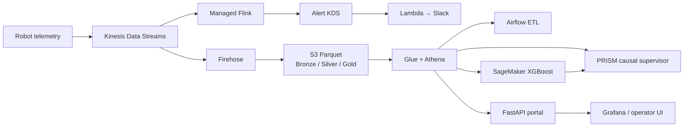

# Robot Data Platform + PRISM

> 스마트 팩토리 로봇 텔레메트리를 수집·처리·운영하고, 예측 결과를 인과 기반 의사결정으로 연결하는 AWS 플랫폼 엔지니어링 프로젝트

생성한 로봇 센서 데이터를 수집·저장·검증하는 데이터 플랫폼입니다. Kinesis·S3 수집, Glue 기반 RDS 이관, 재처리와 적재 지연 관측을 구현했습니다. 로봇 1,000대는 설계 시나리오이며 실제 운영 대수가 아닙니다. 같은 데이터 계약을 사용하는 오프라인 PRISM 데모도 별도 경로로 포함합니다.

## 구현 내용과 검증 기록

S3 → Glue → 사설 RDS 이관의 구현과 소량 AWS 실행 기록은 다음 경로에서 확인할 수 있습니다.

- 데이터 계약과 처리 경계: [이관 설계](docs/public/S3-GLUE-RDS-LAB.md), [행 검증·이벤트 키](src/migration/s3_to_rds_contract.py), [Glue 품질 검사](jobs/glue/s3_to_rds.py), [트랜잭션 승격](jobs/glue/promote_batch.py).
- 정상 배치: [2026-09-03 실행 기록](docs/public/evidence/2026-09-03-migration-success.json)에서 원천·staging·승격 각 4건, 같은 배치 재실행 후 target과 고유 `event_id` 각 4건을 확인했습니다.
- 불량 배치: [같은 날 거부 기록](docs/public/evidence/2026-09-03-migration-reject.json)의 원천 2건은 정상 판정 1건·계약 위반 1건입니다. 계약 위반이 있으면 배치 전체를 차단하므로 정상 판정 행도 적재하지 않으며, staging·승격은 모두 0건이고 기존 target 4건은 유지됐습니다.
- 검증 범위: [증거 해석 기준](docs/public/evidence/README.md)과 [계약 테스트](tests/migration/test_s3_to_rds_contract.py)를 함께 읽습니다. 위 수치는 서울 리전의 소량 실행 기록이며, 대규모 처리량·고가용성·장기 SLO·전체 경로의 exactly-once를 입증하지 않습니다.

## 한눈에 보는 결과

| 영역 | 구현 |
|---|---|
| Streaming | Kinesis Data Streams → Firehose → S3 Parquet, 시간 prefix + Athena partition projection |
| Lakehouse | Bronze/Silver/Gold, Glue/Athena Partition Projection |
| Platform | EKS, Karpenter, HPA/PDB, IRSA, ALB, Helm pinning |
| Batch/ML | Airflow 2.10.5 DAG, SageMaker XGBoost 학습·재배포 |
| Observability | CloudWatch, ADOT/X-Ray, Grafana 5종 대시보드, Slack alert |
| IaC/GitOps | Terraform 모듈, GitHub Actions OIDC, 배포 후 검증 |
| AI decision layer | DoWhy 6-node causal DAG, 4-agent supervisor, Bedrock cache replay |
| Reproducibility | DuckDB 기반 오프라인 데모, 고정 seed/hash, 회귀 테스트 |

## 아키텍처



- 설계와 트레이드오프: [`docs/public/ARCHITECTURE.md`](docs/public/ARCHITECTURE.md)
- 운영 신뢰성 사례: [`docs/public/RELIABILITY.md`](docs/public/RELIABILITY.md)
- PRISM ↔ production 계약: [`docs/public/INTERFACE.md`](docs/public/INTERFACE.md)

## 5분 오프라인 데모

AWS 비용이나 계정 없이 PRISM 의사결정 흐름을 재현할 수 있습니다.

```bash
cd prism
cp .env.example .env
docker compose up --build
```

| URL | 화면 |
|---|---|
| <http://localhost:8501> | 결정론적 cache-replay 데모 |
| <http://localhost:8502> | Bedrock live 모드 |
| <http://localhost:8503> | operator-first 콘솔 |

- 실행 상세: [`prism/README.md`](prism/README.md)
- 운영자 시나리오: [`prism/operator-guide.md`](prism/operator-guide.md)

## 검증

```bash
make setup
make lint
make test
make infra-check
```

지원 Python은 `.python-version`의 3.11로 고정합니다. PR과 `main` push에서는 같은 명령으로 critical Python lint, deterministic core tests, Terraform format/validate를 실행합니다.

Airflow 2.10.5 DAG contract는 별도 CI job에서 검증하고, AWS 의존 E2E는 수동 실행 계층으로 분리합니다. 비용이 드는 production 검증을 로컬 core test와 동일한 증거로 표현하지 않습니다.

## 비용 최소화 검증 경로

스트리밍 데이터 계약과 freshness/lag SLO만 확인할 때는 전체 EKS 플랫폼을 만들지 않고 [`terraform/validation`](terraform/validation)을 사용합니다. 이 프로필은 Kinesis 2 shards, Firehose 1개, S3/Glue/CloudWatch만 만들며, 기존 전체 plan 104개 대비 14개 리소스로 줄였습니다. EKS worker·NAT Gateway·ALB·RDS·SageMaker·Slack/Lambda는 생성하지 않습니다.

저비용 프로필의 기본값은 Kinesis 24시간 보존, Firehose `64MB/60초`, S3 증거 1일 보존입니다. Parquet 변환을 유지하려면 Firehose 버퍼가 64MB 이상이어야 하므로 크기는 더 낮추지 않고 flush interval을 300초에서 60초로 줄였습니다. 100Hz 중심 4시간 검증은 약 `$1~$3`, 1,000Hz를 4시간 연속 전송하는 경우는 데이터량에 따라 약 `$4~$6`으로 추정합니다. 수치는 리전·데이터 크기·실행 시간에 따라 달라지는 사전 모델이며, 실제 실행 뒤 apply/destroy 시간과 함께 기록합니다.

실제 CDN 비용 없이 멀티리전·멀티CDN 장애 전환 정책을 연습하려면 [`docs/public/EDGE-FAILOVER-LAB.md`](docs/public/EDGE-FAILOVER-LAB.md)의 결정론적 lab을 실행합니다. 주 리전 장애 후 2초 failover RTO와 `cdn-a → cdn-b` 전환을 재현하지만, 실제 라이브 미디어/CDN 운영 증거로 확대하지 않습니다.

실제 HLS·CloudFront·Cloudflare 경로까지 짧게 검증하려면 [`docs/public/MEDIA-LAB.md`](docs/public/MEDIA-LAB.md)를 사용합니다. 두 리전 private S3와 CloudFront OAC, Cloudflare Worker primary/fallback 경로를 만들고 HLS playlist·segment 및 controlled failover를 측정한 뒤 Worker와 AWS 리소스를 모두 teardown합니다.

## 데이터 운영 실습 확장

로봇 텔레메트리 운영에서 자주 필요한 원천 검증·재처리·감사 흐름도 별도 실습
프로필로 분리했습니다. S3 Bronze Parquet를 AWS Glue Spark에서 데이터 계약으로
검증하고, 정상 행만 private RDS staging을 거쳐 target으로 승격합니다. 계약 위반
행은 S3 reject와 감사 장부에 남기며, `event_id`와 DB 제약으로 재실행 중복을
막습니다. 실제 서울 리전 실행에서 정상 4건은 4건으로 승격됐고 같은 batch replay
후에도 target 4건을 유지했으며, 잘못된 2건은 1건 reject·0건 승격으로 끝났습니다.

- 이관 설계와 재현 절차: [`docs/public/S3-GLUE-RDS-LAB.md`](docs/public/S3-GLUE-RDS-LAB.md)
- 실제 실행 증적: [`docs/public/evidence/2026-09-03-migration-success.json`](docs/public/evidence/2026-09-03-migration-success.json), [`docs/public/evidence/2026-09-03-migration-reject.json`](docs/public/evidence/2026-09-03-migration-reject.json)
- 작업 판단 기록: [`docs/public/data-engineering-log.md`](docs/public/data-engineering-log.md)
- 트러블슈팅: [`docs/public/troubleshooting.md`](docs/public/troubleshooting.md)
- 직접 실습 순서: [`docs/public/lessonrun.md`](docs/public/lessonrun.md)
- 날씨 예보 품질·공간 제품: [`docs/architecture/forecast-quality-spatial-product.md`](docs/architecture/forecast-quality-spatial-product.md)
- Kafka 이벤트의 날짜별 Parquet 저장: Kafka 저장소의 [`docs/LAKEHOUSE-PARQUET-LAB.md`](https://github.com/masondev1024/KafKa/blob/main/docs/LAKEHOUSE-PARQUET-LAB.md)

2026-08-24에는 별도의 short-lived 전체 EKS profile도 실행해 100 records/s 수집 구간, Firehose freshness, Bronze Parquet 적재와 API/Grafana readiness를 실제 AWS에서 확인했습니다. 이번 실행 직전 계정에 Managed Flink application이 없었기 때문에 anomaly alert 발화와 Slack 전달은 재실행하지 않았으며, 과거 실행에서 확보한 증거와 이번 미디어 Lab 범위는 분리해 기록했습니다. 수치와 한계는 [`docs/public/RELIABILITY.md`](docs/public/RELIABILITY.md)와 [`docs/public/FLINK-ANOMALY-CONTRACT.md`](docs/public/FLINK-ANOMALY-CONTRACT.md)에 분리해 기록했습니다.

루트 `terraform/` 전체 스택은 비용 실수를 막기 위해 `allow_full_stack_apply=false`가 기본입니다. EKS·EC2·NAT·ALB·RDS·SageMaker를 검증해야 할 때만 비용 승인 후 `-var='allow_full_stack_apply=true'`를 명시하고, 일반 스트리밍 검증에는 validation 프로필을 사용합니다. 상세 선택 근거와 비용 비교는 [`docs/public/COST-ESTIMATE.md`](docs/public/COST-ESTIMATE.md)와 [`docs/public/ARCHITECTURE.md`](docs/public/ARCHITECTURE.md)에 기록했습니다.

## 계정 이식성과 배포 안전 게이트

- K8s·Helm·Athena 배포 원본에는 AWS 계정 ID, 리전, 버킷, 이미지 태그를 고정하지 않습니다. `scripts/render_deployment.py`가 검증된 비밀 아닌 좌표만 별도 디렉터리에 렌더링하며 원본은 수정하지 않습니다.
- GitHub Actions는 OIDC 세션의 STS identity로 계정을 확인하고, 컨테이너 이미지를 Git commit SHA로만 배포합니다. `latest` 태그는 workload 계약에서 금지합니다.
- 배포 전 GitHub Repository Variables에 `AWS_ACCOUNT_ID`, `AWS_REGION`, `EKS_CLUSTER_NAME`, `S3_BUCKET_NAME`을 등록합니다. 실제 STS account가 `AWS_ACCOUNT_ID`와 다르면 배포는 렌더링 전에 종료됩니다.
- 로컬에서 AWS를 변경하는 셋업 스크립트는 명시한 계정과 실제 STS account가 일치해야 진행합니다. 장기 access key는 입력 계약에 포함하지 않습니다.
- Airflow 관리자 비밀번호는 Helm values에 두지 않습니다. `/robot-telemetry/airflow-admin-password`를 Secrets Manager에 만든 뒤 `scripts/sync_airflow_admin_secret.sh`로 Kubernetes Secret을 먼저 동기화해야 하며, 스크립트는 STS account 일치 여부를 Secret 조회 전에 검사합니다.
- Terraform CI는 현재 `fmt/init -backend=false/validate`까지만 허용합니다. 새 계정의 remote state, state locking, OIDC trust를 bootstrap하기 전에는 plan/apply를 배포 증거로 주장하지 않습니다.

```bash
cp .env.example .env
RENDER_ROOT="$(mktemp -d /tmp/robot-deploy.XXXXXX)"
AWS_ACCOUNT_ID=123456789012 \
AWS_REGION=ap-northeast-2 \
EKS_CLUSTER_NAME=robot-telemetry-cluster \
S3_BUCKET_NAME=globally-unique-bucket \
IMAGE_TAG="$(git rev-parse HEAD)" \
python3 scripts/render_deployment.py --output "$RENDER_ROOT"

# Airflow를 처음 설치하기 전에 namespace와 bootstrap Secret을 준비
bash scripts/sync_airflow_admin_secret.sh
```

## 플랫폼 엔지니어링에서 강조한 문제

- **장애를 코드와 가드레일로 환원:** KDS 재생성 후 Firehose/Lambda 연결 고착, ratio alarm 단위 오류, stale VolumeAttachment 같은 실제 운영 실패를 runbook과 자동화 조건으로 반영했습니다.
- **비용도 플랫폼 품질로 취급:** HPA·Ingress·ALB·Grafana 잔존으로 생기는 유휴 비용까지 종료 순서에 포함했습니다.
- **보안 경계:** GitHub Actions OIDC, IRSA, Secrets Manager/SSM을 사용하고 webhook·자격증명 하드코딩을 금지합니다.
- **데이터 계약과 재현성:** production Athena와 demo DuckDB가 `DataSource`/`Predictor` 계약을 공유하고, demo는 고정 seed와 cache replay로 재현됩니다.
- **정직한 검증 범위:** 로컬 결정론 테스트와 실제 AWS E2E 상태를 문서에서 분리합니다.

## 저장소 구조

```text
apps/             Streamlit PRISM/operator 콘솔
src/orchestration PRISM causal DAG, agents, data/predictor contracts
src/generator     KDS telemetry producer와 demo CNC stream
src/api           FastAPI portal
src/ml            local/SageMaker predictors와 training
terraform/        AWS 인프라 및 data_pipeline 모듈
k8s/, helm/       EKS workloads, autoscaling, observability, Airflow
dags/, sql/       idempotent batch DAGs와 Athena DDL
grafana/          운영 대시보드 5종
tests/, evals/    unit/smoke/e2e 및 LLM 품질 평가
```

## 현재 범위와 한계

- Managed Flink 코드는 AWS Studio Notebook을 운영 원본으로 사용하므로 이 저장소에는 배포 가능한 Flink 소스가 없습니다.
- 이상치 탐지 계약과 Studio Notebook black-box 검증 방법은 [docs/public/FLINK-ANOMALY-CONTRACT.md](docs/public/FLINK-ANOMALY-CONTRACT.md)에 정리되어 있습니다.
- production AWS E2E는 인프라가 켜진 주기에만 수행합니다.
- CNC telemetry는 demo 전용이며 production `AthenaDataSource`에서 의도적으로 지원하지 않습니다.
- 이 저장소는 포트폴리오 환경을 위한 단일 계정/리전 설계입니다. 다중 계정 landing zone과 조직 단위 정책은 다음 확장 범위입니다.

## 데이터와 라이선스

시연 데이터는 [AI4I 2020 Predictive Maintenance Dataset](https://archive.ics.uci.edu/dataset/601/ai4i+2020+predictive+maintenance+dataset) (CC BY 4.0)을 사용합니다. 원본 전체 데이터와 런타임 DuckDB 파일, 자격증명은 커밋하지 않습니다.
