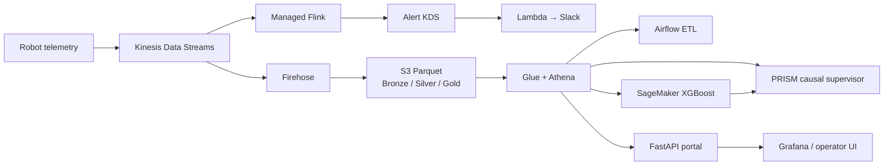

# Robot Data Platform + PRISM

> 스마트 팩토리 로봇 텔레메트리를 수집·처리·운영하고, 예측 결과를 인과 기반 의사결정으로 연결하는 AWS 플랫폼 엔지니어링 프로젝트

이 저장소는 단순 데이터 분석 데모가 아니라 **1,000대 로봇을 가정한 스트리밍·레이크하우스·배치·ML·관측성 플랫폼**과, 같은 데이터 계약을 사용하는 **오프라인 결정론적 PRISM 데모**를 함께 담고 있습니다.

## 한눈에 보는 결과

| 영역 | 구현 |
|---|---|
| Streaming | Kinesis Data Streams → Firehose → S3 Parquet, 동적 파티셔닝 |
| Lakehouse | Bronze/Silver/Gold, Glue/Athena Partition Projection |
| Platform | EKS, Karpenter, HPA/PDB, IRSA, ALB, Helm pinning |
| Batch/ML | Airflow 3 DAG, SageMaker XGBoost 학습·재배포 |
| Observability | CloudWatch, ADOT/X-Ray, Grafana 5종 대시보드, Slack alert |
| IaC/GitOps | Terraform 모듈, GitHub Actions OIDC, 배포 후 검증 |
| AI decision layer | DoWhy 6-node causal DAG, 4-agent supervisor, Bedrock cache replay |
| Reproducibility | DuckDB 기반 오프라인 데모, 고정 seed/hash, 회귀 테스트 |

## 아키텍처



- 설계와 트레이드오프: [`docs/public/ARCHITECTURE.md`](docs/public/ARCHITECTURE.md)
- 운영 신뢰성 사례: [`docs/public/RELIABILITY.md`](docs/public/RELIABILITY.md)
- PRISM ↔ production 계약: [`docs/public/INTERFACE.md`](docs/public/INTERFACE.md)

## 5분 오프라인 데모

AWS 비용이나 계정 없이 PRISM 의사결정 흐름을 재현할 수 있습니다.

```bash
cd prism
cp .env.example .env
docker compose up --build
```

| URL | 화면 |
|---|---|
| <http://localhost:8501> | 결정론적 cache-replay 데모 |
| <http://localhost:8502> | Bedrock live 모드 |
| <http://localhost:8503> | operator-first 콘솔 |

- 실행 상세: [`prism/README.md`](prism/README.md)
- 운영자 시나리오: [`prism/operator-guide.md`](prism/operator-guide.md)

## 검증

```bash
make setup
make lint
make test
make infra-check
```

지원 Python은 `.python-version`의 3.11로 고정합니다. PR과 `main` push에서는 같은 명령으로 critical Python lint, deterministic core tests, Terraform format/validate를 실행합니다.

Airflow 2.10.5 DAG contract는 별도 CI job에서 검증하고, AWS 의존 E2E는 수동 실행 계층으로 분리합니다. 비용이 드는 production 검증을 로컬 core test와 동일한 증거로 표현하지 않습니다.

## 플랫폼 엔지니어링에서 강조한 문제

- **장애를 코드와 가드레일로 환원:** KDS 재생성 후 Firehose/Lambda 연결 고착, ratio alarm 단위 오류, stale VolumeAttachment 같은 실제 운영 실패를 runbook과 자동화 조건으로 반영했습니다.
- **비용도 플랫폼 품질로 취급:** HPA·Ingress·ALB·Grafana 잔존으로 생기는 유휴 비용까지 종료 순서에 포함했습니다.
- **보안 경계:** GitHub Actions OIDC, IRSA, Secrets Manager/SSM을 사용하고 webhook·자격증명 하드코딩을 금지합니다.
- **데이터 계약과 재현성:** production Athena와 demo DuckDB가 `DataSource`/`Predictor` 계약을 공유하고, demo는 고정 seed와 cache replay로 재현됩니다.
- **정직한 검증 범위:** 로컬 결정론 테스트와 실제 AWS E2E 상태를 문서에서 분리합니다.

## 저장소 구조

```text
apps/             Streamlit PRISM/operator 콘솔
src/orchestration PRISM causal DAG, agents, data/predictor contracts
src/generator     KDS telemetry producer와 demo CNC stream
src/api           FastAPI portal
src/ml            local/SageMaker predictors와 training
terraform/        AWS 인프라 및 data_pipeline 모듈
k8s/, helm/       EKS workloads, autoscaling, observability, Airflow
dags/, sql/       idempotent batch DAGs와 Athena DDL
grafana/          운영 대시보드 5종
tests/, evals/    unit/smoke/e2e 및 LLM 품질 평가
```

## 현재 범위와 한계

- Managed Flink 코드는 AWS Studio Notebook을 운영 원본으로 사용하므로 이 저장소에는 배포 가능한 Flink 소스가 없습니다.
- production AWS E2E는 인프라가 켜진 주기에만 수행합니다.
- CNC telemetry는 demo 전용이며 production `AthenaDataSource`에서 의도적으로 지원하지 않습니다.
- 이 저장소는 포트폴리오 환경을 위한 단일 계정/리전 설계입니다. 다중 계정 landing zone과 조직 단위 정책은 다음 확장 범위입니다.

## 데이터와 라이선스

시연 데이터는 [AI4I 2020 Predictive Maintenance Dataset](https://archive.ics.uci.edu/dataset/601/ai4i+2020+predictive+maintenance+dataset) (CC BY 4.0)을 사용합니다. 원본 전체 데이터와 런타임 DuckDB 파일, 자격증명은 커밋하지 않습니다.
