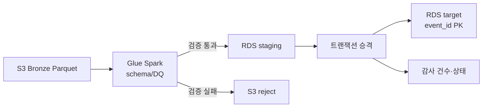

# 데이터 엔지니어 작업 증적

로봇 데이터 파이프라인, 날씨 품질 분석, Kafka 이벤트 처리에서 실제로 만든 것과
검증한 범위를 한 문서에 모아 둔다. 지원서에는 기술 이름을 나열하기보다
**데이터 계약을 정하고, 실패를 격리하고, 다시 실행해도 결과가 바뀌지 않게 만든
과정**을 중심으로 설명한다.

## 1. S3 → Glue → RDS 이관



- 실제 Bronze 컬럼(`robot_id`, 위치, 배터리, 부하, 모터 온도, 시간, 고장 유형)을
  기준으로 계약을 고정했다.
- 잘못된 행은 배치 전체를 닫힌 상태로 실패시키고 reject 경로와 감사 장부에 남긴다.
- Glue 재시도는 at-least-once로 보고, 결정적인 `event_id`와 Target PK·트랜잭션
  승격으로 중복을 막는다. exactly-once라고 과장하지 않는다.
- 이번 실험은 EKS/NAT/상시 Bastion 없이 S3 Gateway Endpoint와 필요한 인터페이스
  Endpoint만 사용한다. RDS는 사설 서브넷의 짧은 단일 AZ 실험 프로필이다.
- 구현 위치: `src/migration/`, `jobs/glue/`, `terraform/migration_lab/`.

## 2. 품질·재처리·관측성

한 배치의 기준은 다음과 같다.

```text
source_rows = accepted_rows + rejected_rows + duplicate_rows
staged_rows = accepted_rows
```

감사 테이블에는 `batch_id`, `attempt_id`, 원천 경로, 각 건수, 실행 상태,
실패 원인, 시작·종료 시각을 기록한다. 따라서 “적재가 됐다”가 아니라
원천→검증→staging→target의 어느 경계에서 멈췄는지 확인할 수 있다.

## 3. 날씨 예보 품질·공간 분석

- 기존 Forecast-Quality Gold는 예보 거리별 기온 MAE/RMSE/편향, 강수 Brier/ECE,
  PTY 정확도, 표본 커버리지와 truth 상태를 계산한다.
- 새 리포트 도구는 Gold export를 날짜·예보 거리별 표로 만들고 provisional,
  degraded, insufficient evidence를 수치와 함께 표시한다.
- 새 공간 제품은 검증된 행정동-기상 격자 매핑과 품질 Gold를 조인해 장소별 품질
  조회 단위를 만든다. 품질 지표가 없는 장소는 `NO_METRICS`로 남긴다.
- 외부 유동인구·부동산 데이터처럼 권한과 출처가 필요한 값은 임의로 생성하지
  않는다. 실제 결합 시 출처·기준 시각·공간 단위·결측 규칙을 데이터 계약으로
  추가한다.

## 4. Kafka 이벤트 → Parquet 분석 저장소

- 원천 JSON/텍스트를 버전이 있는 canonical 이벤트로 정규화하고, 계약 위반은 DLQ로
  분리한다.
- 새 Parquet sink는 `event_id` 장부와 `batch_id`를 기준으로 이벤트 날짜 파티션을
  만든다. 동일 배치 재실행과 다른 배치의 동일 이벤트 모두 중복 저장하지 않는다.
- Kafka offset commit과 파일 commit은 하나의 트랜잭션이 아니므로 전달 의미는
  at-least-once다. 운영 전환 시 Spark Structured Streaming + Iceberg snapshot,
  schema 호환성, consumer lag·freshness 지표를 붙인다.

## 지원서에 쓸 수 있는 요약

> 센서·로봇 이벤트를 버전화된 데이터 계약으로 검증하고, Kafka DLQ와 S3 reject
> 영역으로 오류 데이터를 격리했습니다. S3 Parquet 데이터를 AWS Glue Spark로
> 사설 RDS staging에 적재한 뒤, 결정적 이벤트 키와 트랜잭션 승격으로 재처리
> 중복을 막고 원천·검증·target 건수를 감사 장부로 맞췄습니다. 날씨 예보 품질은
> 격자·행정동 단위로 MAE, Brier score, 커버리지를 비교할 수 있는 Gold 리포트로
> 만들었고, 결과가 없는 지역을 숨기지 않도록 상태를 분리했습니다.

## 결과 기록표

2026-09-03 서울 리전에서 실제로 실행한 결과다. 실행 ID와 원본 JSON은
`evidence/` 아래에 남겼다. RDS CPU와 연결 수는 이번 검증에서 별도 수집하지
않았으므로 비워 두고, 확인하지 않은 값을 추정하지 않는다.

| 항목 | 결과 |
| --- | --- |
| AWS 리전 / 실행 시간 | `ap-northeast-2` / 2026-09-03 10:05~10:35 KST |
| 정상 배치 source rows | 4건 |
| 정상 배치 accepted / rejected / duplicate | 4 / 0 / 0건 |
| 정상 배치 staging / target merged rows | 4 / 4건 |
| 같은 batch 재실행 후 중복 | target 총 4건, 고유 event_id 4건 |
| Glue bootstrap / extract / promote 시간 | 90초 / 140초 / 57초 (초 단위 반올림) |
| 잘못된 배치 source / accepted / rejected | 2 / 1 / 1건 |
| 잘못된 배치 staging / merged rows | 0 / 0건 |
| 거부 사유 | `INVALID_BATTERY_LEVEL` 1건 |
| RDS 최고 CPU·연결 수 | 별도 수집하지 않음 (이번 실험 범위 밖) |
| Parquet sink 테스트 | 6 passed |
| 날씨 report·공간 product 테스트 | 3 passed (추가), 전체 품질 계약 테스트 26 passed |
| destroy 완료 시각 | 2026-09-03 10:47 KST, Terraform 38개 destroy, 전용 리소스 조회 0건 |

AWS Cost Explorer도 같은 날 조회했지만 아직 `Estimated=true`, `UnblendedCost=0
USD`, 서비스별 그룹 없음으로 반환됐다. 이는 최종 청구액이 확정됐다는 뜻이
아니라 비용 데이터 반영 전의 조회 결과다. 따라서 이 문서의 비용 판단은
리소스 구성·실행 시간·즉시 destroy를 근거로 하고, 청구서가 반영되면 별도로
갱신한다.

## 관련 문서

- `S3-GLUE-RDS-LAB.md`: 이관 실습·장애·비용 기준
- `data-engineering-log.md`: 작업 순서와 판단 근거
- `troubleshooting.md`: 실제 장애·실패 원인과 재발 방지
- `lessonrun.md`: 직접 재현할 때의 학습 순서와 면접 설명 포인트
- `evidence/2026-09-03-migration-success.json`: 정상 배치 최종 검증 원본
- `evidence/2026-09-03-migration-reject.json`: 거부 배치 최종 검증 원본
- `ARCHITECTURE.md`: 로봇 전체 데이터 흐름
- Kafka 레포의 `docs/LAKEHOUSE-PARQUET-LAB.md`: 이벤트 저장소 전환 경계
- 날씨 레포의 `docs/architecture/forecast-quality-spatial-product.md`: 공간 품질 제품
