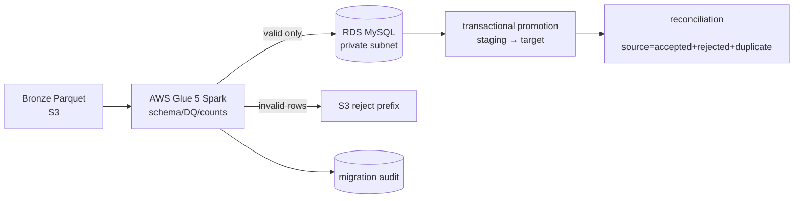

# S3 → Glue → RDS 이관 실습 설계

이 문서는 로봇 텔레메트리 Bronze 데이터를 S3에서 읽어 사설 RDS MySQL로 적재하는
짧은 검증 환경의 설계와 운영 기준을 남긴다. 기존 저장소의 Bronze 컬럼을 그대로
사용하며, 일반적인 예시 컬럼명(`temperature`, `event_time`)을 섞지 않는다.

## 목표 경로



RDS로 가는 실제 네트워크 경로는 Glue 작업의 탄력적 네트워크 인터페이스에서
사설 RDS 보안 그룹으로 향한다. 운영자가 DB를 확인할 때만 별도의 접속 경로를
사용한다. 이번 최소 비용 실험에는 상시 Bastion과 NAT Gateway를 만들지 않고,
S3 Gateway Endpoint와 필요한 AWS API VPC Endpoint만 사용한다.

## 데이터 계약과 멱등성

| 구분 | 기준 |
| --- | --- |
| 필수 컬럼 | `robot_id`, `pos_x`, `pos_y`, `battery_level`, `current_load`, `motor_temp`, `timestamp`, `failure_type` |
| 품질 규칙 | 숫자 유한값, 배터리·부하 0~100, 모터 온도 -40~200, 타임존 포함 시간, 6종 고장 코드 |
| 이벤트 키 | 정규화한 업무 컬럼을 정렬된 JSON으로 만든 SHA-256 `event_id` |
| 재처리 | Glue 재시도는 `attempt_id`가 다를 수 있지만 동일 이벤트 키를 유지하고, Target PK에서 중복을 제거 |
| 전달 의미 | Glue와 DB 사이의 전체 exactly-once를 주장하지 않는다. 입력은 at-least-once이며 DB 승격을 멱등적으로 만든다. |

잘못된 행이 하나라도 있으면 기본 동작은 해당 배치를 닫힌 상태로 실패시키는 것이다.
유효한 행만 먼저 넣고 성공으로 기록하는 방식은 부분 성공을 놓칠 수 있기 때문이다.
거부 행은 `reject_path`에 저장하고 감사 테이블에 원인과 건수를 남긴 뒤, 원천 파일을
수정하거나 계약 버전을 올려 재처리한다.

### 이번 AWS 검증에서 확인한 연결 조건

- Glue Connection은 `JDBC` 타입이어야 하며 `JDBC_CONNECTION_URL`과
  `SECRET_ID`가 함께 있어야 한다. Glue 작업의 네트워크 연결은 별도의
  `PhysicalConnectionRequirements`에서 사설 서브넷과 보안 그룹으로 지정한다.
- Glue 작업용 보안 그룹은 동일 보안 그룹에서 전체 포트 인바운드를 허용해야
  Glue ENI끼리 통신할 수 있다. 이 규칙의 source는 자기 SG로 제한했고
  `0.0.0.0/0`을 열지 않았다.

## RDS 테이블

`jobs/glue/sql/robot_telemetry_schema.sql`은 세 역할로 나뉜다.

- `robot_telemetry_migration_stg`: Glue가 시도 단위로 append하는 원본 보관 영역
- `robot_telemetry_migration_audit`: 원천·검증·staging·target 건수와 상태를 기록하는 운영 장부
- `robot_telemetry`: 서비스 조회 대상. `event_id`와 `(robot_id, event_time)`로 중복을 차단

승격 작업은 한 트랜잭션에서 수행한다. 실패하면 rollback하고 감사 상태를
`PROMOTION_FAILED`로 바꾼다. 비밀번호는 Glue 인자나 로그가 아니라 Secrets Manager에서
읽는다.

## 실행 순서

```bash
# 1. 샘플 Parquet 생성·S3 업로드
python scripts/create_migration_fixture.py --output /tmp/robot-migration/sample.parquet
aws s3 cp /tmp/robot-migration/sample.parquet "s3://$MIGRATION_BUCKET/bronze/2026-09-03/sample.parquet" \
  --profile develope-test --region ap-northeast-2

# 2. RDS에 스키마 설치: 실험에서는 SSM 포트포워딩 또는 일회성 접속 경로 사용
mysql --host "$RDS_ENDPOINT" --user "$DB_USER" --password "$DB_PASSWORD" telemetry \
  < jobs/glue/sql/robot_telemetry_schema.sql

# 3. Glue Job 실행
aws glue start-job-run --job-name "$GLUE_JOB_NAME" --region ap-northeast-2 \
  --arguments '{"--SOURCE_PATH":"s3://.../bronze/2026-09-03/","--BATCH_ID":"20260903-01",...}'

# 4. 성공 후 승격 Job 실행
aws glue start-job-run --job-name "$PROMOTE_JOB_NAME" --region ap-northeast-2 \
  --arguments '{"--BATCH_ID":"20260903-01","--ATTEMPT_ID":"attempt-01",...}'
```

실제 명령의 값은 `terraform output`과 Secrets Manager에서 채운다. 샘플의 목표는
작은 파일로 계약·감사·멱등성을 확인하는 것이며, 1,000대 로봇 규모의 처리량을
증명하는 자료가 아니다. 처리량 검증은 별도의 크기별 실험으로 `source_rows`,
`staged_rows`, `merged_rows`, Glue 실행시간, RDS CPU/연결 수를 함께 기록한다.

## 장애·재처리 기준

1. 스키마 오류: Glue를 실패시키고 reject prefix와 감사 상태를 확인한다.
2. Glue 중단: 같은 `batch_id`에 새 `attempt_id`로 재실행한다. Target PK 때문에 중복이 생기지 않아야 한다.
3. DB 연결 실패: staging은 남을 수 있으므로 승격 작업을 재시도한다. 감사 장부와 target 건수를 다시 대조한다.
4. 부분 승격: 트랜잭션 rollback 여부와 `(robot_id, event_time)` 고유 제약을 확인한다.
5. 늦게 도착한 파일: 원천 날짜를 기준으로 별도 batch를 만들고, 변경 데이터 양과 재계산 범위를 기록한다.

## 비용·운영 선택

- EKS, NAT Gateway, ALB, 읽기 전용 RDS 복제본을 이 실습의 기본 경로에서 제외한다.
- RDS는 `db.t4g.micro`, 20 GiB, 단일 AZ, 백업 보존 0일, 삭제 보호 해제로 짧게 사용한다.
- Glue는 G.1X 2개, 동시 실행 1개, 10분 제한으로 고정한다.
- 검증이 끝나면 S3 객체와 RDS를 포함한 Terraform 스택을 즉시 destroy한다.
- 위 선택은 비용을 아끼기 위한 실험 프로필이다. 다중 AZ·백업·읽기 복제본은 장애복구
  검증이 필요한 별도 프로필로 분리해야 한다.

## 증적 기록 양식

| 항목 | 기록값 |
| --- | --- |
| AWS 리전 / 실행 시각 | `ap-northeast-2` / 2026-09-03 10:05~10:47 KST |
| batch / attempt | 정상 `robot-demo-20260903` / `attempt-02`, 거부 `robot-invalid-20260903` / `attempt-01` |
| source / accepted / rejected / duplicate | 정상 4 / 4 / 0 / 0건, 거부 2 / 1 / 1 / 0건 |
| staged / merged / 최종 target count | 정상 4 / 4 / 4건, 거부 0 / 0 / 기존 4건 유지 |
| Glue 실행시간 / 최대 RDS CPU / DB 연결 수 | bootstrap 90초, extract 140초, promote 57초 / 미수집 / 미수집 |
| 재처리 결과 | target 총 4건·고유 `event_id` 4건 유지 |
| destroy 완료 시각 | 2026-09-03 10:47 KST (38개 리소스 삭제, 전용 리소스 조회 0건) |

## 2026-09-03 실제 실행 결과

서울 리전(`ap-northeast-2`)의 짧은 실험 프로필에서 확인한 결과다. 증적 JSON에는
접속 비밀번호나 Secret 값이 들어 있지 않다.

| 검증 | source | accepted | rejected | staged | merged | target | 판정 |
| --- | ---: | ---: | ---: | ---: | ---: | ---: | --- |
| 정상 `robot-demo-20260903` | 4 | 4 | 0 | 4 | 4 | 4 | 성공 |
| 거부 `robot-invalid-20260903` | 2 | 1 | 1 | 0 | 0 | 기존 4 유지 | 성공 |

정상 배치는 같은 승격 작업을 replay한 뒤에도 target 총 4건·고유 event_id
4건으로 유지됐다. 거부 배치의 잘못된 행은 `battery_level=120`이었고
`INVALID_BATTERY_LEVEL`로 reject됐다. extract 작업은 정책상 실패하고 감사
장부를 남겼으며, 최종 verify 작업에서 source 2 / accepted 1 / rejected 1 /
merged 0을 확인했다.

- 정상 증적: `evidence/2026-09-03-migration-success.json`
- 거부 증적: `evidence/2026-09-03-migration-reject.json`

검증이 끝난 뒤 Terraform `destroy`가 38개 리소스를 삭제했다. 전용 프로젝트
태그 기준 VPC, RDS, NAT Gateway, VPC Endpoint가 0건이고, Glue Job·Secret·S3
버킷도 이름 조회 결과가 없음을 확인했다. Cost Explorer 당일 조회는 아직
`Estimated=true`, `UnblendedCost=0 USD`였으므로 확정 청구액으로 표현하지 않는다.
