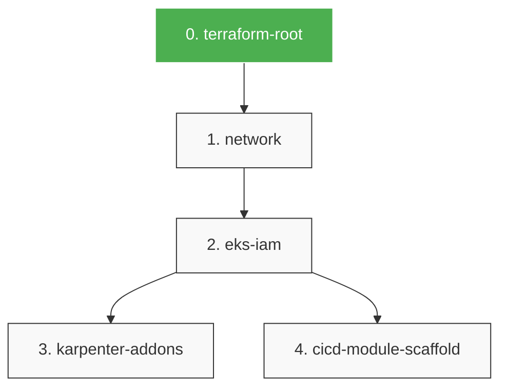

# Phase DAG: 0-setup

```mermaid
graph TD
  classDef completed fill:#4CAF50,stroke:#fff,color:#fff;
  classDef pending fill:#f9f9f9,stroke:#333;
  classDef error fill:#f44336,stroke:#fff,color:#fff;
  classDef blocked fill:#FF9800,stroke:#fff,color:#fff;
  S0["0. terraform-root"]
  class S0 completed;
  S1["1. network"]
  class S1 pending;
  S0 --> S1
  S2["2. eks-iam"]
  class S2 pending;
  S1 --> S2
  S3["3. karpenter-addons"]
  class S3 pending;
  S2 --> S3
  S4["4. cicd-module-scaffold"]
  class S4 pending;
  S2 --> S4
```
