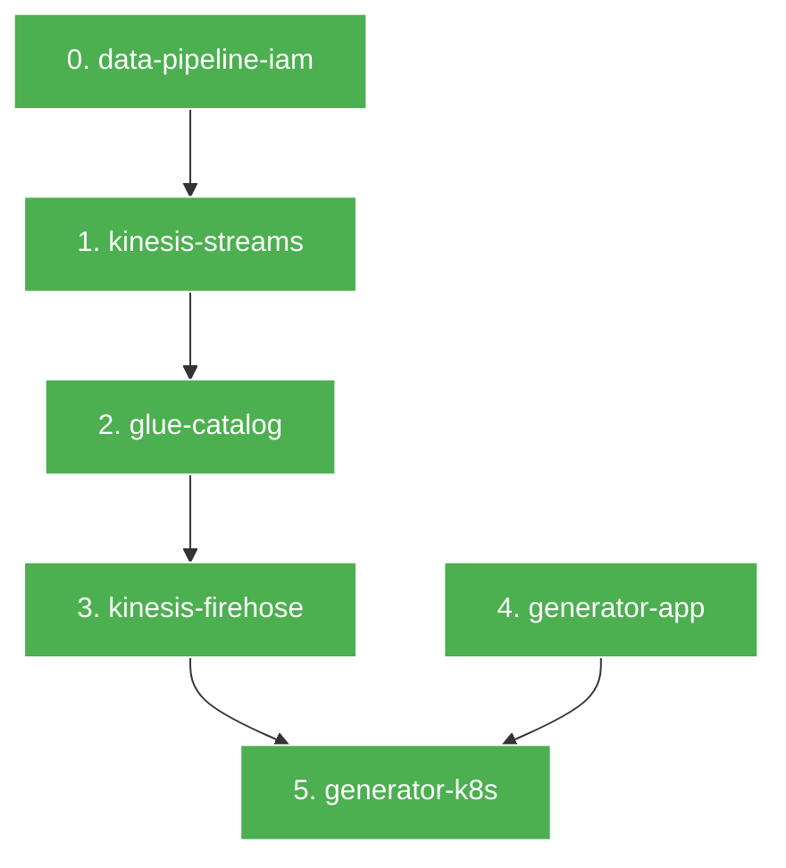

# Phase DAG: 1-ingestion

```mermaid
graph TD
  classDef completed fill:#4CAF50,stroke:#fff,color:#fff;
  classDef pending fill:#f9f9f9,stroke:#333;
  classDef error fill:#f44336,stroke:#fff,color:#fff;
  classDef blocked fill:#FF9800,stroke:#fff,color:#fff;
  S0["0. data-pipeline-iam"]
  class S0 completed;
  S1["1. kinesis-streams"]
  class S1 completed;
  S0 --> S1
  S2["2. glue-catalog"]
  class S2 completed;
  S1 --> S2
  S3["3. kinesis-firehose"]
  class S3 completed;
  S2 --> S3
  S4["4. generator-app"]
  class S4 completed;
  S5["5. generator-k8s"]
  class S5 completed;
  S3 --> S5
  S4 --> S5
```
