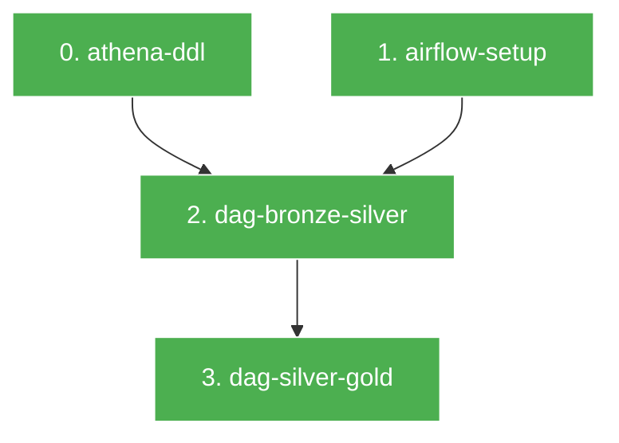

# Phase DAG: 2-batch

```mermaid
graph TD
  classDef completed fill:#4CAF50,stroke:#fff,color:#fff;
  classDef pending fill:#f9f9f9,stroke:#333;
  classDef error fill:#f44336,stroke:#fff,color:#fff;
  classDef blocked fill:#FF9800,stroke:#fff,color:#fff;
  S0["0. athena-ddl"]
  class S0 completed;
  S1["1. airflow-setup"]
  class S1 completed;
  S2["2. dag-bronze-silver"]
  class S2 completed;
  S0 --> S2
  S1 --> S2
  S3["3. dag-silver-gold"]
  class S3 completed;
  S2 --> S3
```
