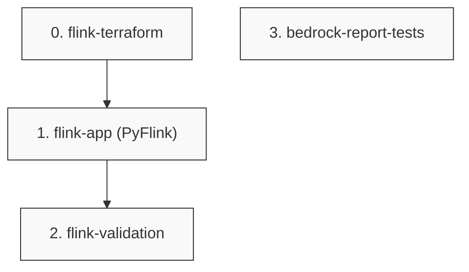

# Phase DAG: 3-realtime

## 병렬성

- `S0 → S1 → S2`는 의존성 체인 (S1은 S0의 property_map 참조, S2는 S1의 순수 함수 import)
- `S3`은 독립 (`depends_on: []`) — Phase 2 산출물(`dags/robot_daily_etl.py`)만 의존하므로 S0~S2와 병렬 실행 가능
- execute.py가 자동으로 S0과 S3을 동시 시작
