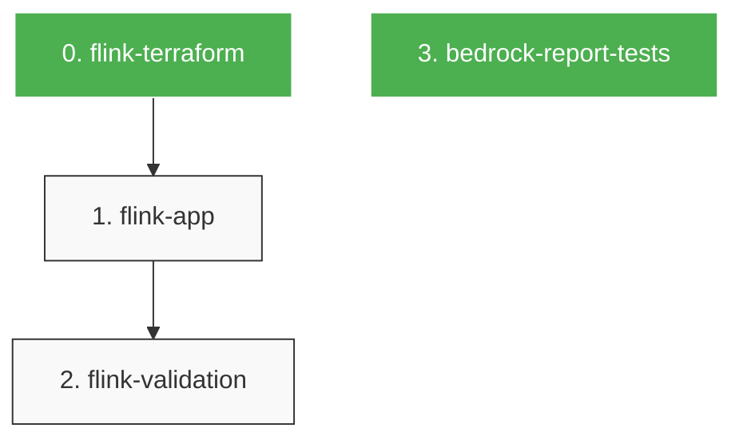

# Phase DAG: 3-realtime

```mermaid
graph TD
  classDef completed fill:#4CAF50,stroke:#fff,color:#fff;
  classDef pending fill:#f9f9f9,stroke:#333;
  classDef error fill:#f44336,stroke:#fff,color:#fff;
  classDef blocked fill:#FF9800,stroke:#fff,color:#fff;
  S0["0. flink-terraform"]
  class S0 completed;
  S1["1. flink-app"]
  class S1 pending;
  S0 --> S1
  S2["2. flink-validation"]
  class S2 pending;
  S1 --> S2
  S3["3. bedrock-report-tests"]
  class S3 completed;
```
