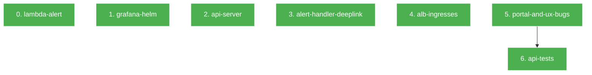

# Phase DAG: 4-serving

```mermaid
graph TD
  classDef completed fill:#4CAF50,stroke:#fff,color:#fff;
  classDef pending fill:#f9f9f9,stroke:#333;
  classDef error fill:#f44336,stroke:#fff,color:#fff;
  classDef blocked fill:#FF9800,stroke:#fff,color:#fff;
  S0["0. lambda-alert"]
  class S0 completed;
  S1["1. grafana-helm"]
  class S1 completed;
  S2["2. api-server"]
  class S2 completed;
  S3["3. alert-handler-deeplink"]
  class S3 completed;
  S4["4. alb-ingresses"]
  class S4 completed;
  S5["5. portal-and-ux-bugs"]
  class S5 completed;
  S6["6. api-tests"]
  class S6 completed;
  S5 --> S6
```
