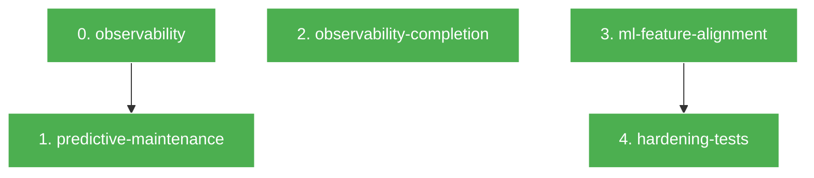

# Phase DAG: 5-hardening

```mermaid
graph TD
  classDef completed fill:#4CAF50,stroke:#fff,color:#fff;
  classDef pending fill:#f9f9f9,stroke:#333;
  classDef error fill:#f44336,stroke:#fff,color:#fff;
  classDef blocked fill:#FF9800,stroke:#fff,color:#fff;
  S0["0. observability"]
  class S0 completed;
  S1["1. predictive-maintenance"]
  class S1 completed;
  S0 --> S1
  S2["2. observability-completion"]
  class S2 completed;
  S3["3. ml-feature-alignment"]
  class S3 completed;
  S4["4. hardening-tests"]
  class S4 completed;
  S3 --> S4
```
